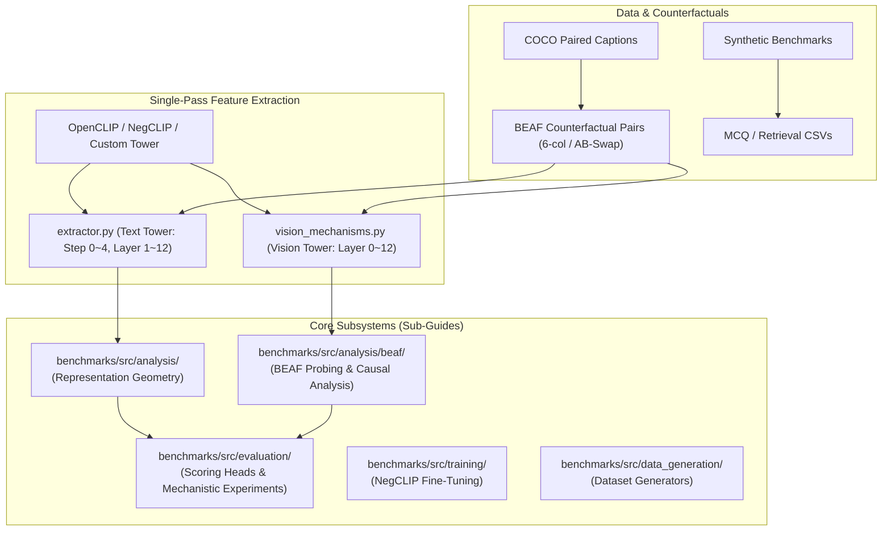

# NegBench: Representation Analysis & Mechanism Subsystem Technical Hub (GUIDE.md)

> **목적 / Purpose**: 본 문서는 `NegBench` 프로젝트의 전체 아키텍처, 수학적 수식, 외부 모듈 요약 및 하위 모듈별 세부 기술 가이드로 연결되는 **중앙 허브 문서(Technical Hub)**입니다.

---

## 🇰🇷 한국어

### 1. 서브시스템 개요 및 핵심 연구 질문

* **연구 배경**: Vision-Language Model(CLIP, NegCLIP 등)은 부정어(Negation)가 포함된 텍스트와 이미지를 올바르게 매칭하지 못함 (CVPR 2025 NegBench).
* **핵심 질문 (Core Research Questions)**:
  1. **Representation Loss인가, Scoring Head(Cosine)의 한계인가?**
     * 텍스트 인코더와 비전 인코더의 잠재 공간에 부정 정보가 보존되어 있는가? (Linear Probing, SVD, Subspace Analysis)
     * 파라미터가 0개인 Cosine Similarity($\approx 1:1$ 대각 차원 매칭)가 병목인가, 아니면 차원 간 상호작용(Bilinear/MLP)이 필요한가?
  2. **소수 숏컷 차원인가, 분산 표현인가? (Sparse vs. Distributed)**
     * 프로브의 높은 정확도가 1~2개 소수 차원에 의존하는가, 512차원 전체에 고르게 분산되어 있는가?
  3. **BEAF (Benchmark Evaluation & Analysis Framework)**:
     * 원본 이미지($\text{Orig}$, 객체 존재)와 Inpainting 편집 이미지($\text{CF}$, 객체 부재)로 구성된 1:1 Counterfactual Pair를 사용하여 인코더 메커니즘을 인과적으로 정밀 검증.

---

### 2. 프로젝트 전체 아키텍처

---

### 3. 디렉토리별 세부 기술 가이드 (Hub Navigation)

각 디렉토리 내부에 상세 구현 정보, 파일별 API, 실행 방법이 기술된 개별 `GUIDE.md`가 마련되어 있습니다.

| 서브시스템 디렉토리 | 가이드 링크 | 주요 내용 요약 |
|:---|:---|:---|
| **Analysis Core** | [`benchmarks/src/analysis/GUIDE.md`](benchmarks/src/analysis/GUIDE.md) | 16단계 파이프라인 특징 추출, 기하 메트릭 계산, 부분공간 SVD, 소수 차원 가설 검증, 가중치 에너지 분석 (14개 파일) |
| **BEAF Framework** | [`benchmarks/src/analysis/beaf/GUIDE.md`](benchmarks/src/analysis/beaf/GUIDE.md) | Counterfactual 로더, 4종 PyTorch 프로브 팩토리, 2×2 Factorial ANOVA, 비전 트랜스포머 레이어 분해, AB-Swap 감사 및 인과 평가 (12개 파일) |
| **Evaluation Suite** | [`benchmarks/src/evaluation/GUIDE.md`](benchmarks/src/evaluation/GUIDE.md) | MCQ/Retrieval 평가, 8종 Scoring Head, Negation-Aware OpenCLIP 래퍼, E1~E4 Unary 메커니즘, 숏컷 절제 진단 (23개 파일) |
| **Training Pipeline** | [`benchmarks/src/training/GUIDE.md`](benchmarks/src/training/GUIDE.md) | NegCLIP 분산 파인튜닝 루프, CsvMCQDataset, 하이퍼파라미터 파서, 비디오 유틸리티 (16+ 파일) |
| **Data Generation** | [`benchmarks/src/data_generation/GUIDE.md`](benchmarks/src/data_generation/GUIDE.md) | COCO Paired Caption 생성, BEAF AB-Swap 데이터셋 생성기 및 `synthetic_datasets/` 상호 참조 (3개 파일) |
| **Data Schema Reference** | [`DATA_SCHEMA.md`](DATA_SCHEMA.md) | 21개 평가/분석 CSV 스키마 정의 및 컬럼별 매핑 명세 |
| **실행 명령** | [`benchmarks/scripts/`](benchmarks/scripts/) + 각 스크립트 모듈 docstring의 `Usage:` 블록 | 셸 래퍼는 `benchmarks/scripts/*.sh`, 단일 스크립트 실행법은 해당 파일 상단 docstring이 정본입니다 |

---

### 4. 외부 및 연동 모듈 요약

#### `benchmarks/src/open_clip/` (23개 파일 — 수정된 OpenCLIP 포크)
* **모델 아키텍처 및 변환**: `model.py`, `transformer.py`, `coca_model.py`, `modified_resnet.py`, `timm_model.py`, `hf_model.py`, `pos_embed.py`, `transform.py`
* **팩토리 및 로더**: `factory.py`, `pretrained.py`, `tokenizer.py`, `openai.py`, `hf_configs.py`, `big_vision.py`
* **학습 및 유틸리티**: `loss.py`, `zero_shot_classifier.py`, `zero_shot_metadata.py`, `push_to_hf_hub.py`, `utils.py`, `constants.py`, `version.py`, `__init__.py`

#### `benchmarks/src/llava/` (6개 파일 — LLaVA 평가 스위트)
* `llava_evaluator.py`: LLaVA 모델 추론 및 로짓 평가 엔진
* `dataset_utils.py`: LLaVA 데이터셋 전처리 및 로더
* `logits.py`: 선택지 로짓 계산 및 확률 정규화
* `metrics.py`: LLaVA MCQ 정확도 메트릭
* `parser.py`: LLaVA CLI 인자 파서
* `reprocess_predictions.py`: 예측 결과 후처리 및 집계

#### `benchmarks/src/e5v_analysis/` (4개 파일 — E5-V 분석)
* `e5v_wrapper.py`: E5-V 모델 래퍼
* `eval_negbench_e5v.py`: E5-V 대상 NegBench 평가 엔트리포인트
* `utils.py`: E5-V 데이터 로딩 및 평가 유틸리티
* `__init__.py`: 패키지 초기화

#### `synthetic_datasets/` (합성 데이터셋 생성 패키지)
* `evaluation/` (7개 파일): `create_mcq.py`, `filter_negative_objects.py`, `generate_uncovered_mcq.py`, `paraphrase_captions.py`, `process_caption_objects.py`, `process_video_tasks.py`, `README.md`
* `finetuning/` (8개 파일): `combine_csv_files.py`, `create_mcq.py`, `filter_negative_objects.py`, `generate_negative_captions.py`, `paraphrase_captions.py`, `process_caption_objects.py`, `validate_object_lists.py`, `README.md`

---

### 5. 수학적 모델 및 알고리즘 총정리

#### ① 텍스트 인코더 16단계 기하 구조 분석 (`benchmarks/src/analysis/run_analysis.py`)
1. **단일 패스 추출 (`extractor.py`)**:
   * `Step 0 (Embed)`: 토큰 + 위치 임베딩 ($h_0$)
   * `Layer 1 ~ 12`: 트랜스포머 잔차 블록 출력 중 EOT 토큰 풀링 ($h_1 \dots h_{12}$)
   * `Step 2 (LN)`: Layer 12 통과 후 LayerNorm ($z_{\text{LN}}$)
   * `Step 3 (Proj)`: 선형 투영 ($z_{\text{proj}} = z_{\text{LN}} W_{\text{proj}}$)
   * `Step 4 (L2Norm)`: 최종 정규화 ($z_{\text{final}} = z_{\text{proj}} / \|z_{\text{proj}}\|_2$)
2. **레이어별 코사인 유사도 계산 (`metrics.py`)**:
   $$\text{CosineSim}(h_{\text{pos}}^{(l)}, h_{\text{neg}}^{(l)}) = \frac{h_{\text{pos}}^{(l)} \cdot h_{\text{neg}}^{(l)}}{\|h_{\text{pos}}^{(l)}\|_2 \|h_{\text{neg}}^{(l)}\|_2}$$
3. **단계별 선형 프로빙 (`metrics.py`)**:
   * $X = [Z_{\text{pos}}; Z_{\text{neg}}]$, $y = [\mathbf{1}_N; \mathbf{0}_N]$ 구성 후 `StratifiedKFold(n_splits=5)`로 Logistic Regression 학습.

#### ② BEAF 4-Way Cross Cosine & 2×2 Factorial ANOVA (`benchmarks/src/analysis/beaf/beaf_stats.py`)
4가지 상호 유사도 매트릭스:
* $A = \text{sim}(\text{Img}_{\text{orig}}, \text{Txt}_{\text{pos}})$ (원본 이미지 $\times$ 긍정 캡션)
* $B = \text{sim}(\text{Img}_{\text{orig}}, \text{Txt}_{\text{neg}})$ (원본 이미지 $\times$ 부정 캡션)
* $C = \text{sim}(\text{Img}_{\text{cf}}, \text{Txt}_{\text{pos}})$ (객체 부재 이미지 $\times$ 긍정 캡션)
* $D = \text{sim}(\text{Img}_{\text{cf}}, \text{Txt}_{\text{neg}})$ (객체 부재 이미지 $\times$ 부정 캡션)

3대 직교 주효과(Orthogonal Main Effects):
$$\text{Text Main Effect} = \frac{(A - B) + (C - D)}{2} \quad (\text{텍스트가 점수를 주도하는 편향})$$
$$\text{Visual Main Effect} = \frac{(A - C) + (B - D)}{2} \quad (\text{시각적 객체 유무가 점수를 주도하는 정도})$$
$$\text{Interaction Effect} = (A - B) - (C - D) \quad (\text{시각-텍스트 결합 부정어 해결 능력})$$

#### ③ 프로브 모델 수식 정의 (`benchmarks/src/analysis/beaf/probe_factory.py`)
| 모델 클래스 | 수식 정의 | 특징 및 용도 |
|:---|:---|:---|
| `ElementWiseNonLinearPyTorch` | $f(x) = \sum_d w_d \cdot \text{GELU}(x_d) + b$ | 차원 간 혼합 0% (순수 비선형성 대조군) |
| `LowRankBilinearPyTorch` | $f(x) = \sum_{r=1}^R (x U_r)(x V_r) + x w_{\text{lin}} + b$ | Low-rank 교차 차원 상호작용 |
| `FullBilinearPyTorch` | $f(x) = x^T W x + x w_{\text{lin}} + b$ | Full $D \times D$ 2차 형식 상호작용 |
| `MLPVisionPyTorch` | $f(x) = W_2 \cdot \text{GELU}(W_1 x + b_1) + b_2$ | 2계층 비선형 MLP |

#### ④ Bilinear $W$ 행렬 에너지 분해 (`benchmarks/src/evaluation/analyze_internal_weights.py`)
* $\text{Total Energy} = \sum_{i, j} W_{i, j}^2$
* $\text{Diagonal Energy (Direct Matching)} = \sum_i W_{i, i}^2 \approx \mathbf{2.83\%}$
* $\text{Off-Diagonal Energy (Cross-Dimension Interaction)} = \text{Total} - \text{Diag} \approx \mathbf{97.17\%}$
* ⚠️ **이 비율을 "교차 차원이 지배적"의 근거로 쓰지 말 것.** 512×512 행렬에는 비대각 성분이 **511배**
  많으므로 에너지가 완전히 균등한 **무작위 행렬조차 비대각이 99.8%**이며, 97.17%는 그보다 낮다.
  성분 하나당으로 환산하면 대각이 비대각의 **14.9배**(균등이면 1.0배)이고, 대각 비율 2.83%는 우연
  기준 0.195%의 **14.5배**다. 즉 이 수치가 말하는 것은 "$W$가 여전히 대각 편향적"이다.
  ($W$는 `torch.eye`로 초기화되고 전배치로 학습되어 시드 없이도 결정적이며, 2026-08-29 재실행에서
  2.83% / 97.17%가 정확히 재현되었다: `logs/evaluation/02_archive/2026-08-29_ii4_internal_weights/`)
* **결론**: 코사인이 1:1 대각 매칭만 수행하는 것과 달리 부정 판별에는 비대각 교차 상호작용이 필요하다.
  **단 그 근거는 위 에너지 비율이 아니라 E4 절제다** — 대각 성분만 남기면 0.62%, 비대각만 남기면
  83.15%로, 절제는 성분 개수 효과에 오염되지 않고 각 성분군의 실제 기여를 직접 잰다
  (`eval_unary_mechanistic_analysis.py`의 E4, `RESULTS.md` §7).

#### ⑤ 부정 부분공간 및 유효 랭크 (`benchmarks/src/analysis/subspace_analysis.py`)
* 부정 차이 벡터 $D = X_{\text{pos}} - X_{\text{neg}}$의 공분산 고유값 $\lambda_i$로부터 산출:
  $$p_i = \frac{\lambda_i}{\sum \lambda_i}, \quad H = -\sum p_i \ln p_i, \quad r_{\text{eff}} = \exp(H)$$
* Participation Ratio: $\text{PR} = \frac{(\sum \lambda_i)^2}{\sum \lambda_i^2}$

#### ⑥ 소수 차원 가설 검증 (`benchmarks/src/analysis/eval_sparse_text_dimensions.py`)
* 가중치 벡터 $w$의 차원을 절대값 순으로 정렬 후 상위 $k$개 차원만 남기고 0으로 절제:
  * $k=1, 2, 5, 10, 20, 50, 100, 512$에 대한 Zero-shot Ablated Accuracy 측정.
  * 소수 차원만으로는 성능이 급락하여 **"부정 정보는 고차원에 고르게 분산(Distributed)되어 있다"**는 사실 증명.

#### ⑦ AB Compositional Swap 인과성 평가 (`benchmarks/src/analysis/beaf/run_ab_swap_evaluation.py`)
* **1순위 (2×2 Joint Consistency)**:
  $$\min(S(I_{XY}, T_{XY}), S(I_{YX}, T_{YX})) > \max(S(I_{XY}, T_{YX}), S(I_{YX}, T_{XY}))$$
* **2순위 (Text Separability)**: $T_{XY}$ vs $T_{YX}$의 코사인 유사도 및 프로빙 분리도.
* **3순위 (Vision Per-Pair Probing)**: $I_{XY}$ vs $I_{YX}$의 Base Scene GroupKFold 분리도.
* **4순위 (Image-Blind Forced-Choice)**: `image_blind_xy_preference_pct` 편향 비율 진단.

#### ⑧ Negation Existence Probe (`benchmarks/src/evaluation/eval_negation_existence_probe.py`)
* **Exp A (Layer-wise Pairwise Cosine Distance)**: Counterfactual Pair ($T_{XY}, T_{YX}$) 간 코사인 유사도를 전 레이어에 걸쳐 측정.
* **Exp B (Per-Object Polarity Probe)**: 각 객체 $O$에 대해 양쪽 모두 단어 $O$를 포함하는 Affirmed vs Negated 문장을 구성하여 Stratified 5-Fold LogReg로 극성 방향 검증.

#### ⑨ Scoring Head 8종 수식 및 표현력 (`benchmarks/src/evaluation/scoring_heads.py`)
1. **CosineScorer**: $S(v, t) = \frac{v}{\|v\|_2} \cdot \frac{t}{\|t\|_2}$
2. **WeightedCosineScorer**: $S(v, t) = \sum_{d} w_d \cdot (v_d \cdot t_d)$
3. **BilinearScorer**: $S(v, t) = v^T W t + w_v^T v + w_t^T t + b$
4. **LogisticRegressionScorer**: $S(v, t) = w^T [v; t] + b$
5. **ShallowMLPScorer**: $S(v, t) = W_2 \cdot \text{GELU}(W_1 [v; t] + b_1) + b_2$
6. **DeepMLPScorer**: 4-Layer Residual MLP with LayerNorm & GELU over $[v; t]$
7. **LowRankBilinearScorer**: $S(v, t) = (A v) \cdot (B t) + w_v^T v + w_t^T t + b \quad (A, B \in \mathbb{R}^{R \times D})$
8. **NonLinearBiEncoderScorer**: $S(v, t) = \text{GELU}(A v) \cdot \text{GELU}(B t) + w_v^T v + w_t^T t + b$

#### ⑩ Negation-Aware OpenCLIP 4종 가설 변환 (`benchmarks/src/evaluation/modified_clip.py`)
1. **`baseline`**: 표준 OpenCLIP forward pass
2. **`procrustes_orthogonal` (H1)**: $z' = z Q \quad (Q^T Q = I)$
3. **`hyperplane_projection` (H2)**: $t' = \text{L2Norm}(t + \lambda (t \cdot w) w)$
4. **`subspace_bilinear` (H4)**: $M = I + \alpha U_{\text{neg}}^T U_{\text{neg}}$

---

### 6. 리팩토링 변경 이력 요약

1. **PyTorch 프로빙 모델 단일화 (`probe_factory.py`)**: `vision_mechanisms.py`, `object_experiment.py`, `train_beaf_dual_probes.py`에 난립해 있던 중복 클래스 정의를 `probe_factory.py`로 일원화.
2. **공용 유틸리티 및 시드 일원화 (`config.py`)**: `to_bool()`, `get_layer_features()`, `set_seed()`, `DEFAULT_TUNING_GRIDS` 등록.
3. **수학적 오류 및 실험 모호성 교정**:
   * `subspace_analysis.py`: `--split_by object_name` 강제 지원.
   * `run_beaf_analysis_v2.py`: 3-bit 진리표(8가지 경우) 완전 배타적 매핑.
   * `run_ab_swap_evaluation.py`: 메트릭 명칭을 `image_blind_xy_preference_pct`로 명확화.

---

### 7. 실험 설계상 한계 및 리뷰어 대응 전략

1. **`DualClassifierProductScorer`의 무조건부(Unconditional) 모순**:
   * $f_V(v)$는 텍스트 입력이 없으므로 특정 이미지 $v$에 대해 단일 상수만 출력함.
   * MCQ 평가 시 객체가 없는 이미지에서도 부정 선택지가 무조건 음수가 되어 오답을 선택하는 이론적 모순 발생 $\rightarrow$ 조건부 결합(Bilinear $v^T W t$ 등) 사용 필수.
   * (2026-08-30 수정) 이와 별개로 **체크포인트 왕복이 깨져 있었다**. `vision_type`은 `forward`가 세 비전
     분류기 중 무엇을 실행할지 고르는 값인데 `load_weights`가 설정할 뿐 `state_dict`에는 없었다.
     재로드는 `build_scorer`를 거치므로 기본값 `"mlp"`로 되돌아가고, 텐서는 복원되었는데 **0으로 초기화된
     MLP 분기**가 돌아 모든 점수가 정확히 0.0이 되었다. 예외는 나지 않고 MCQ 선택지가 전부 동점이 되어
     무작위 타이브레이크로 넘어간다. 이제 `get_extra_state`/`set_extra_state`가 `vision_type`·rank·
     hidden_dim·`use_hard_sign`를 함께 저장하고, `_load_from_state_dict`가 체크포인트 형상에 맞춰
     파라미터를 먼저 크기 조정한다. 옛 체크포인트는 경고를 찍고 생성자 설정을 가정한다.
2. **Text Probe 99.9%의 Token-Presence 편향**:
   * Positive vs Negative 문장으로만 학습된 Linear Probe는 'not' 토큰 존재만 감지했을 가능성 $\rightarrow$ Word-Swap Counterfactual Pair(`eval_word_swap_probe.py`)로 대응.
3. **BEAF Inpainting Artifacts 간섭 가능성**:
   * Inpainting 생성 흔적(Blur/Brush)이 숏컷이 되지 않도록 `audit_ab_swap_dataset.py`로 0순위 감사 수행.

---

---
## 🇺🇸 English

### 1. Subsystem Overview & Core Research Questions

* **Background**: Vision-Language Models (CLIP, NegCLIP) consistently struggle to match images with negated text captions (CVPR 2025 NegBench).
* **Core Research Questions**:
  1. **Representation Loss vs. Cosine Scoring Bottleneck**: Is negation preserved in latent representations, and is parameter-free cosine similarity the bottleneck requiring cross-dimensional interaction (Bilinear/MLP)?
  2. **Sparse Shortcut vs. Distributed Representation**: Does high probe accuracy rely on a few dimensions or distributed across 512 dimensions?
  3. **BEAF Framework**: Causal verification of encoder mechanisms via 1:1 counterfactual image pairs ($\text{Orig}$ vs $\text{CF}$).

---

### 2. System Architecture Diagram

See Mermaid diagram in Section 2 above.

---

### 3. Subsystem Directory Guides (Hub Navigation)

| Subsystem Directory | Guide Link | Key Scope |
|:---|:---|:---|
| **Analysis Core** | [`benchmarks/src/analysis/GUIDE.md`](benchmarks/src/analysis/GUIDE.md) | 16-step extraction, geometric metrics, subspace SVD, sparse dimensions, weight analysis (14 files) |
| **BEAF Framework** | [`benchmarks/src/analysis/beaf/GUIDE.md`](benchmarks/src/analysis/beaf/GUIDE.md) | Counterfactual loader, 4 PyTorch probes, 2×2 ANOVA, vision transformer analysis, AB-swap audit (12 files) |
| **Evaluation Suite** | [`benchmarks/src/evaluation/GUIDE.md`](benchmarks/src/evaluation/GUIDE.md) | MCQ/Retrieval eval, 8 Scoring Heads, modified OpenCLIP wrapper, E1–E4 unary mechanics, ablation (23 files) |
| **Training Pipeline** | [`benchmarks/src/training/GUIDE.md`](benchmarks/src/training/GUIDE.md) | NegCLIP distributed fine-tuning, CsvMCQDataset, hyperparameter parser, video utils (16+ files) |
| **Data Generation** | [`benchmarks/src/data_generation/GUIDE.md`](benchmarks/src/data_generation/GUIDE.md) | COCO paired captions, BEAF AB-Swap generator, and `synthetic_datasets/` cross-reference (3 files) |
| **Data Schema Reference** | [`DATA_SCHEMA.md`](DATA_SCHEMA.md) | Schema definitions and column mappings for all 21 dataset CSVs |
| **Execution** | [`benchmarks/scripts/`](benchmarks/scripts/) + each module's `Usage:` docstring | Shell wrappers live in `benchmarks/scripts/*.sh`; for a single script, the `Usage:` block at the top of that file is authoritative |

---

### 4. External & Integration Modules Summary

#### `benchmarks/src/open_clip/` (23 files — Modified OpenCLIP Fork)
* **Model Architectures & Transforms**: `model.py`, `transformer.py`, `coca_model.py`, `modified_resnet.py`, `timm_model.py`, `hf_model.py`, `pos_embed.py`, `transform.py`
* **Factories & Loaders**: `factory.py`, `pretrained.py`, `tokenizer.py`, `openai.py`, `hf_configs.py`, `big_vision.py`
* **Training & Utilities**: `loss.py`, `zero_shot_classifier.py`, `zero_shot_metadata.py`, `push_to_hf_hub.py`, `utils.py`, `constants.py`, `version.py`, `__init__.py`

#### `benchmarks/src/llava/` (6 files — LLaVA Evaluation Suite)
* `llava_evaluator.py`: LLaVA model inference & logit evaluation engine
* `dataset_utils.py`: LLaVA dataset preprocessing and loader
* `logits.py`: Candidate logit computation & probability normalization
* `metrics.py`: LLaVA MCQ accuracy metrics
* `parser.py`: LLaVA CLI argument parser
* `reprocess_predictions.py`: Post-processing and prediction aggregator

#### `benchmarks/src/e5v_analysis/` (4 files — E5-V Analysis)
* `e5v_wrapper.py`: E5-V model wrapper
* `eval_negbench_e5v.py`: NegBench evaluation entrypoint for E5-V
* `utils.py`: E5-V data loading and evaluation utilities
* `__init__.py`: Package initialization

#### `synthetic_datasets/` (Synthetic Dataset Generation)
* `evaluation/` (7 files): `create_mcq.py`, `filter_negative_objects.py`, `generate_uncovered_mcq.py`, `paraphrase_captions.py`, `process_caption_objects.py`, `process_video_tasks.py`, `README.md`
* `finetuning/` (8 files): `combine_csv_files.py`, `create_mcq.py`, `filter_negative_objects.py`, `generate_negative_captions.py`, `paraphrase_captions.py`, `process_caption_objects.py`, `validate_object_lists.py`, `README.md`

---

### 5. Comprehensive Mathematical Formulations

See Section 5 in Korean above for complete mathematical derivations and formulas (① through ⑩).

---

### 6. Refactoring Changelog

1. **Probe Factory Centralization (`probe_factory.py`)**: Consolidated duplicate PyTorch probe definitions into a single source of truth.
2. **Shared Utilities & Seeding (`config.py`)**: Standardized `to_bool()`, `get_layer_features()`, `set_seed()`, and `DEFAULT_TUNING_GRIDS`.
3. **Statistical Corrections**: Enforced `--split_by object_name` in `subspace_analysis.py`, 3-bit exhaustive classification in `run_beaf_analysis_v2.py`, and clarified `image_blind_xy_preference_pct` in `run_ab_swap_evaluation.py`.

---

### 7. Limitations & Mitigation Strategies

1. **Unconditional Product Scorer Paradox**: $f_V(v)$ outputs a static constant without text conditioning $\rightarrow$ Must use conditional interaction ($v^T W t$).
   *(Fixed 2026-08-30, separately: the checkpoint round trip was broken.* `vision_type` selects which of three
   vision classifiers `forward` runs and was set only by `load_weights`, never stored in `state_dict`. A reload
   goes through `build_scorer`, which constructs the default `"mlp"`, so the tensors came back and the
   **zero-initialised MLP branch** ran: every score exactly 0.0, all MCQ options tied, resolved by the random
   tie-break. `get_extra_state`/`set_extra_state` now persist `vision_type`, rank, hidden dim and
   `use_hard_sign`, and `_load_from_state_dict` resizes the parameters to the checkpoint first. Checkpoints
   predating this warn and assume the constructor's configuration.)
2. **Token-Presence Bias**: Addressed via Word-Swap counterfactual probes (`eval_word_swap_probe.py`).
3. **Inpainting Artifacts**: Addressed via Priority 0 dataset audits (`audit_ab_swap_dataset.py`).
