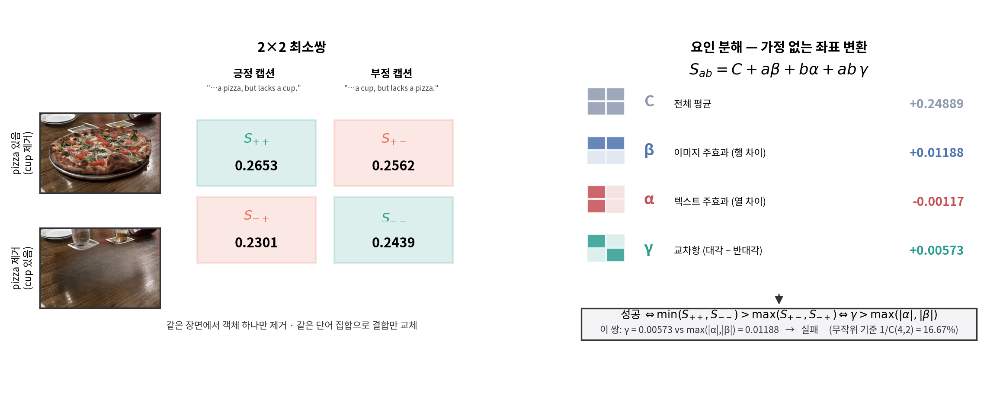
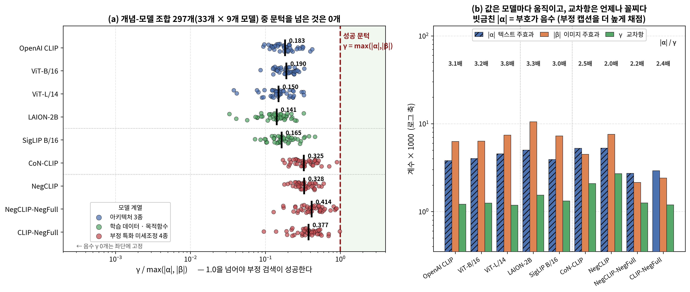
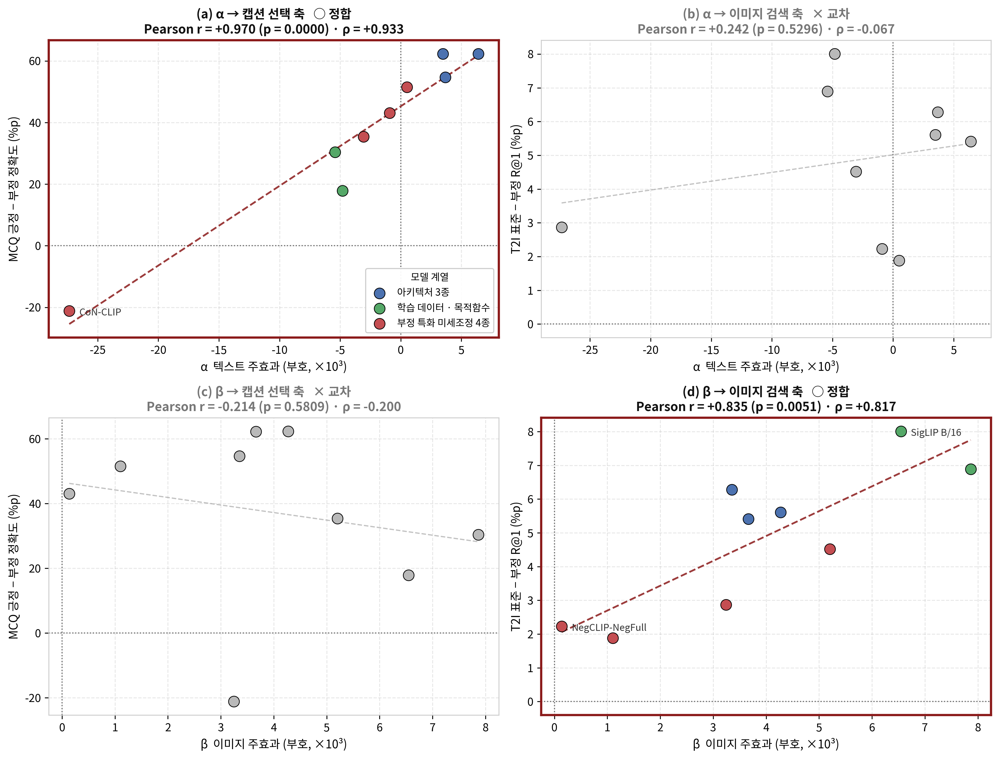
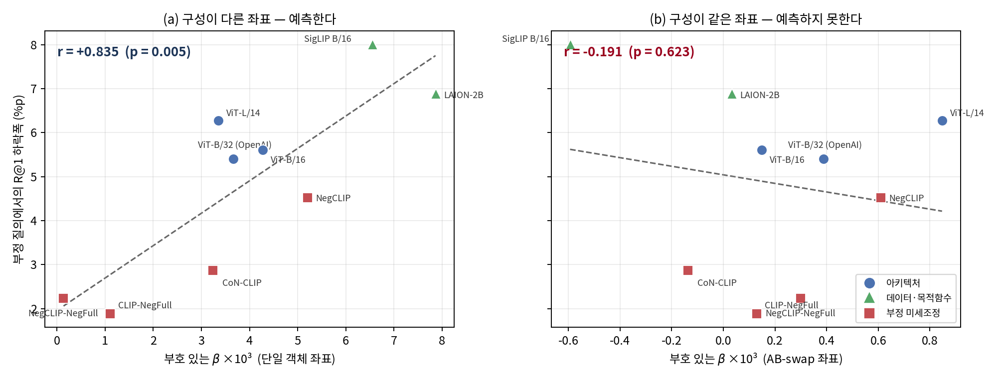
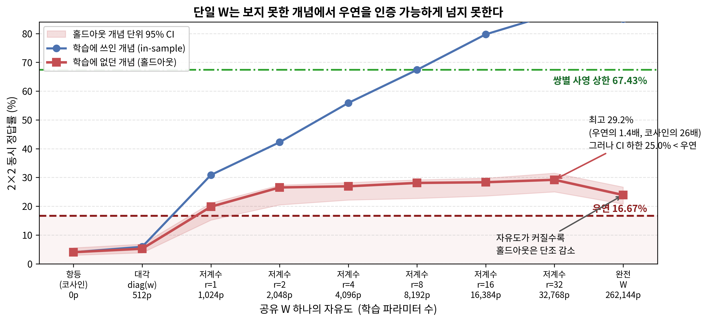
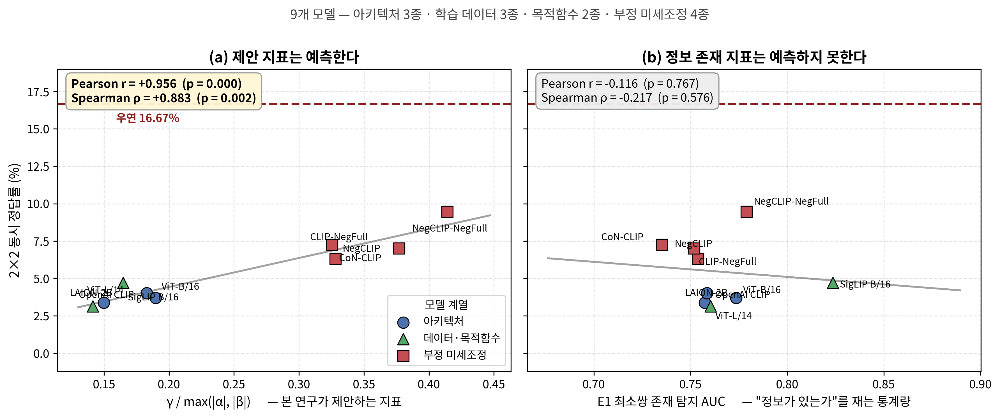

# 주효과가 교차항을 압도한다: 객체 단위 통제 하에서 CLIP 부정 검색 실패의 대수적 재진단

**Main Effects Overwhelm the Interaction: An Algebraic Re-diagnosis of CLIP's Negation Retrieval Failure under Object-Level Control**

*저자·소속 (미정)*

---

## 초록

CLIP 계열 시각-언어 모델이 부정 쿼리에서 실패한다는 것은 반복 보고되었고, 최근 진단들은 서로 다른 해법을 제안하면서 하나의 전제를 공유한다. **필요한 정보는 인코더에 이미 표현되어 있으며 실패는 정렬 또는 결합 단계에서 일어난다**는 것이다. 이 전제는 서로 다른 장면끼리 비교한 존재 탐지, 부정 표지의 유무로 갈리는 문장 쌍의 극성 프로빙, 그리고 합성 데이터셋의 객체별 프로빙에 근거한다. 세 증거 모두 관심 변인 외의 요인이 통제되지 않았다.

본 연구는 **같은 장면에서 객체 하나만 제거한 이미지 최소쌍**과 **단어 집합이 동일하고 결합만 뒤바뀐 텍스트 최소쌍**으로 이 전제를 재검토한다. 전제는 살아남는다. 통제된 조건에서도 객체 존재 신호는 유지된다(최소쌍 존재 탐지 macro AUC 0.759). 그러나 같은 데이터에서 2×2 매칭 정확도는 **4.03%**로, 네 점수가 교환 가능할 때의 기준 16.67%를 크게 밑돈다. (그 기준이 이 데이터에 맞는지도 검정한다 — 결합을 끊은 실증 대조는 0.67%다.)

두 관찰의 공존을 해명하기 위해 2×2 유사도를 평균·이미지 주효과 β·텍스트 주효과 α·교차항 γ로 분해한다. 이는 가정 없는 좌표 변환이며, 이 좌표계에서 부정 검색 성공의 필요충분조건은 항등식 Δ(S) = 2γ − 2max(|α|,|β|)에 의해 **γ > max(|α|,|β|)**로 정확히 주어진다. 이 판정은 Winoground [7]의 group score와 동치이며, 같은 분해가 나머지 두 표준 지표도 특성화한다 — **캡션 선택(text score)은 γ > |α|, 이미지 검색(image score)은 γ > |β|와 정확히 동치다.** 즉 계열 전체의 채점 규칙이 세 계수의 크기 비교로 환원되고, 이진 판정이 "얼마나 부족한가"라는 연속량으로 바뀐다. 42개 개념 2,480쌍에서 |α| = 0.0038, |β| = 0.0063, γ = 0.0012로, 교차항은 통계적으로 실재하되 — **42개 개념 전부에서 부트스트랩 95% CI가 엄격히 양수다** — 지배하는 주효과의 1/5.2다. 두 주효과는 크기가 클 뿐 **부호가 개념마다 임의여서**(α > 0인 개념 15/42) 평균에서 상쇄되는 반면 γ의 부호는 언제나 옳다. 실패의 구조는 "모델이 긍정을 선호한다"가 아니라 **방향이 없는 큰 항이 방향이 옳은 작은 항을 덮는 것**이다. 이 **교차항 열위**는 아키텍처 3종·학습 데이터 3종·목적함수 2종·부정 특화 미세조정 4종에 걸친 **아홉 개 모델에서 개념 단위로 재현된다 — γ가 세 계수 중 가장 작은 개념-모델 조합이 378개 중 368개(97.4%)이고, 성공 조건 γ > max(|α|,|β|)를 만족하는 조합은 378개 중 0개다.** 무작위 이하 성능은 확률적 오차가 아니라 이 순서가 강제하는 결정론적 역전이다.

세 계수는 공개된 개입 계열의 도달 가능성을 예측한다. 텍스트 측 순수 증폭은 α와 γ를 같은 배율로 키워 비율을 정의상 보존하지만, **아홉 모델 중 순수 증폭에 해당하는 것은 하나도 없다.** 이미지 증폭은 γ > |β|를 요구하므로 측정된 조합 거의 전부에서 불가능하다. 부정 특화 미세조정은 사전 등록한 예측을 깨고 비율을 최대 2.3배 끌어올리는데, 그 경로는 교차항 증폭이 아니라 **텍스트 주효과를 0으로 통과시키는 것**이며 그럼에도 필요한 크기의 41%에 그친다. 방향 정렬은 실제로 적용했을 때 이론값의 절반에 그쳐 사전 등록한 판정에서 실패했다. 남는 후보는 점수 함수 자체의 교체다. 같은 임베딩을 두 단봉 프로브의 **이진 출력 두 비트로만** 읽고 조합하면 코사인이 4.03%인 블록에서 **26.13%**에 닿고(우연 16.67%, p = 9.5×10⁻³³), 그중 rank-1 형태 v^T(w_I w_T^T)t가 24.96%로, 같은 좌표에서 개념 비의존으로 학습된 rank 2의 26.53%에 근접한다 — **학습된 저계수 헤드가 찾아내는 것의 상당 부분은 두 단봉 극성 검출기의 외적이다.** 그리고 **학습된 공유 변환 하나가 학습에 없던 개념에서 우연 초과를 인증한다** — rank 2에서 26.53%, rank 32에서 29.19%로 코사인의 7.2배이며, 개념 매크로 CI 하한이 16.67%를 넘는다. 이 진단이 배제하는 것은 넓고 지지하는 것은 좁다. 아홉 모델은 group과 이미지 검색에서 **예외 없이 교환 가능 기준을 밑돌지만**(group ≤ 9.5% < 16.7%, 이미지 검색 ≤ 23.8% < 25%), 캡션 선택에서는 부정 미세조정 두 모델이 우연을 넘는다(27.1%, 25.7% > 25%) — 텍스트 축 하나는 넘길 수 있으나 두 축을 동시에 요구하는 판정은 넘기지 못한다. 마지막으로 좌표계를 측정 데이터 밖에서 검정한다. NegBench의 COCO·VOC MCQ 10,866문항에서 γ/max는 총 정확도를 유의하게 예측하지 못하는 반면(r = +0.624, p = 0.073), **부호 있는 α는 긍정 문항과 부정 문항의 정확도 격차를 r = +0.970 (p = 1.5×10⁻⁵)으로 예측한다.** 단 이 예측은 **단일 객체 캡션 좌표에서만 성립하며**(결합을 통제한 좌표에서는 r = +0.302), NegBench 문항 자체가 단일 객체 부정이라는 사실이 그 조건이다 — 측정 자극과 평가 자극의 구성이 일치할 때만 예측이 선다. 같은 형태의 예측이 **갤러리 검색에서 축을 바꿔 재현된다** — §3의 분해가 T2I 검색을 구속하는 계수로 지정하는 것은 β이며, 실제로 부호 있는 β가 COCO 5,000장 갤러리에서 부정 질의의 R@1 하락폭을 **r = +0.835 (p = 0.005)** 로 예측한다. 두 과제 모두에서 예측되는 것은 성적이 아니라 **부정이 무엇을 얼마나 빼앗는가**다. 선행 연구가 "정보는 있다"의 근거로 쓰는 존재 탐지 AUC는 어느 쪽도 예측하지 못한다(r = −0.116 / +0.027 / −0.134). **이 진단이 주는 것은 성능의 순위가 아니라 실패의 방향이다.**

**핵심어:** CLIP, 부정 이해, 시각-언어 모델, 객체 단위 통제, 요인 분해, 크로스모달 결합

---

## 1. 서론

이중 인코더 시각-언어 모델은 이미지와 텍스트를 공유 공간으로 사상하고 두 벡터의 내적을 매칭 점수로 쓴다. 이 인터페이스는 제로샷 검색에서 강력하지만 부정 쿼리에서는 신뢰할 수 없다 [1].

최근 진단들은 개입 지점이 서로 다르다. 텍스트 인코더 내부를 스티어링하거나 [2], 텍스트 임베딩에 선형 변환을 가해 모달리티를 정렬하거나 [5], 유사도 계산을 외부 논리 실행으로 대체하거나 [3], 코사인을 밀집 토큰 매칭으로 바꾼다 [4]. 그러나 이들은 공통 전제 위에 서 있다.

> **공통 전제.** 부정 검색에 필요한 정보는 인코더에 이미 표현되어 있다. 실패는 표현의 부재가 아니라 정렬 또는 결합의 문제다.

전제의 근거는 세 가지다. [3]은 COCO에서 이미지-개념 존재 탐지 AUC 0.88을 보고하고, [2]는 세 백본에서 레이어 4의 극성 분류 정확도 99% 이상을 보고하며, [5]는 합성 데이터에서 이미지 프로브 0.90–0.97·텍스트 프로브 0.98–0.99를 얻고 "정보가 없는 것이 아니라 정렬이 문제"라고 결론짓는다.

세 증거 모두 통제되지 않은 요인을 포함한다. [3]의 존재 탐지는 객체가 있는 이미지와 **서로 다른 장면**의 객체 없는 이미지를 비교하므로 높은 AUC가 장면 유형 판별로도 달성된다. [2]의 극성 프로빙은 원문과 그 부정문을 비교하므로 프로브가 **어느 객체가 부정되었는지** 모른 채 부정 표지의 유무만 탐지해도 성립한다. [5]는 실제 이미지가 필요한 통제를 제공하지 못한다는 이유로 합성 데이터를 명시적으로 택한다. 따라서 공통 전제는 **자연 이미지에서 장면을 고정한 채로는 검증된 바 없다.**

**[3]과의 관계를 먼저 밝힌다.** [3]은 이중 인코더의 유사도가 연산자와 무관한 개념 증거의 평균 풀링에 가깝다고 진단하고, 연산자 의존 신호가 텍스트 임베딩에 존재하지만 **순위를 바꾸기에는 너무 약하거나 정렬되지 않았다**고 결론짓는다. 본 연구의 정성적 결론은 그것과 같다. 다른 것은 서술의 형태다 — [3]이 "너무 약하다"로 남긴 것을 본 연구는 **γ / max(|α|,|β|) = 0.044라는 측정 가능한 양**으로 바꾸고, 그 양이 개입에 따라 얼마나 움직여야 하는지를 계산한다. 따라서 아래 기여는 새 결론이 아니라 **기존 결론의 좌표계**로 읽어야 한다.

**판정 규칙 자체는 새롭지 않다.** §3이 유도하는 성공 조건은 Winoground [7]의 group score와 동치이고, 그 계열의 text score·image score도 같은 분해의 두 항으로 정확히 떨어진다(§3, 표 1). 본 연구가 더하는 것은 규칙이 아니라 **규칙을 크기 비교로 환원하는 좌표 변환**이며, 그 덕분에 "넘었는가"가 아니라 "얼마나 부족한가"를 물을 수 있게 된다.

본 연구의 기여는 네 가지다.

1. **자연 이미지에서의 객체 단위 통제 프로토콜.** [5]가 통제를 이유로 합성 데이터로 후퇴한 지점에서 객체 제거 최소쌍과 동일 단어 집합 텍스트 최소쌍으로 자연 이미지 조건을 구성하고, 플라시보 검정으로 편집 흔적 가설을 배제한다.
2. **Winoground 계열 세 지표의 정확한 대수적 특성화.** Δ(S) = 2γ − 2max(|α|,|β|)는 근사가 아니라 항등식이며, group score를 γ > max(|α|,|β|)로, text score를 γ > |α|로, image score를 γ > |β|로 환원한다. "정보의 존재"라는 이진 서술이 "계수 간 상대 크기"라는 연속량이 되고, 무작위 이하 성능이 왜 잡음이 아니라 필연인지도 여기서 나온다. 대상은 부정에 한정되지 않는다.
3. **개입 계열의 도달 가능성 — 계산과 실측.** 각 개입이 세 계수를 어떻게 변환하는지 정리하고 상한을 계산한 뒤, 예측이 갈리는 두 지점을 실제로 실행하여 검증한다. 한 지점은 사전 등록한 기준에서 실패했고, 다른 지점은 도달 가능하나 단일 변환으로는 인증되지 않았다. 부정 미세조정 네 종을 계수 공간에서 해부하면 그 개입이 실제로 움직이는 것은 교차항이 아니라 **텍스트 주효과의 부호**임이 드러난다.
4. **교차 차원 구조의 최소 형태.** 차원별 재가중(대각, 512 파라미터)은 학습에 없던 개념에서 5.24%에 그치는 반면, 교차 차원을 쓰는 rank 1(1,024 파라미터)은 19.84%로 **3.8배**다. 파라미터 수가 아니라 구조가 만드는 차이이며, rank 1의 W = ab^T는 비전 검출기와 텍스트 검출기의 곱으로 읽힌다. 인터페이스 교체가 필요하다면 얼마나 작아도 되는지에 대한 하한이다.

---

## 2. 통제된 최소쌍

**이미지.** BEAF [6]가 제공하는 COCO 2014 기반 원본/객체제거 쌍을 쓴다. 각 쌍은 같은 장면에서 특정 객체 하나만 인페인팅으로 제거되었으므로 배경과 나머지 객체가 공유된다. 원본과 편집본이 모두 정상 로드되고 유효 최소쌍이 20개 이상인 카테고리를 평가에 쓴다. AB-swap 캡션과 짝지으면 **42개 카테고리 2,480쌍**이다(개념당 중앙값 45쌍, 범위 20–328). 개념의 단위는 긍정 캡션이 주장하고 부정 캡션이 부인하는 객체이며, `object_in_image`가 추적하는 것도 그 객체다.

**텍스트.** 부정 표지의 유무로 갈리는 평범한 문장 쌍 대신, 두 문장이 **같은 단어 집합을 갖고 결합만 뒤바뀐** AB-swap 쌍을 쓴다.

```
A: There is a truck in this image, but no train.
B: There is a train in this image, but no truck.
```

개념 `truck`에 대해 A는 긍정, B는 부정이다. 두 문장의 **토큰 다중집합이 94.8%에서 동일**하고 **토큰 길이가 99.1%에서 동일**하므로, 부정 표지의 존재를 탐지하는 것만으로는 원리적으로 이득을 얻을 수 없다. 프로브는 "이 문장에 부정이 있는가"가 아니라 "어느 객체가 부정되었는가"를 풀어야 한다. 이 설계는 프레이밍에서 곧바로 나온다 — 문제를 "부정 이해"가 아니라 **극성과 객체의 결합**으로 놓으면 자연스러운 텍스트 쌍이 "긍정문 대 부정문"이 아니라 "같은 단어 집합, 결합만 교체"가 되고, §1이 [2]에서 지적한 교란이 구성 단계에서 차단된다.

**범위.** 결합이 성립하려면 장면에 객체가 둘 이상 있어야 한다. 단일 객체 부정("a photo of no cat")은 결합할 상대가 없으므로 이 구성 밖에 있으며, 본 연구의 진술은 **다객체 장면에서의 극성-객체 결합**으로 한정된다.

****
**Figure 1.** 2×2 최소쌍과 요인 분해. 왼쪽은 실제 한 쌍이다 — 같은 COCO 장면에서 pizza를 지운 이미지와 cup을 지운 이미지(행), 같은 단어 집합으로 결합만 뒤바꾼 두 캡션(열), 그리고 ViT-B/32가 매긴 네 유사도. 상태가 일치하는 두 칸이 초록, 어긋나는 두 칸이 빨강이다. 오른쪽은 그 네 값을 네 계수로 다시 쓴 것으로, **가정 없는 좌표 변환**이다. 이 쌍에서 교차항은 실제로 양수지만(γ = +0.00573) 이미지 주효과가 그 두 배(β = +0.01188)여서 S₋₊가 S₋₋ 아래로 내려가고 판정이 실패한다. 이것이 논문 전체가 재는 구조다.

---

## 3. 요인 분해와 성공 조건

L2 정규화된 임베딩의 내적을 유사도 S(I,T)로 쓰고, 객체 O에 대해 이미지 상태 a ∈ {+1,−1}(존재/부재)와 텍스트 상태 b ∈ {+1,−1}(긍정/부정)을 정의한다. 네 조합의 유사도를 S_ab로 두면 임의의 네 실수는 다음과 같이 **유일하게** 분해된다.

```
S_ab = C + a·β + b·α + a·b·γ
```
```
C = (S₊₊+S₋₊+S₊₋+S₋₋)/4      β = (S₊₊−S₋₊+S₊₋−S₋₋)/4
α = (S₊₊+S₋₊−S₊₋−S₋₋)/4      γ = (S₊₊−S₋₊−S₊₋+S₋₋)/4
```

**부호 규약.** α > 0은 이미지 상태와 무관하게 긍정 캡션을 선호한다는 뜻이고(**긍정 편향**), β > 0은 캡션 극성과 무관하게 객체가 있는 이미지를 선호한다는 뜻이다(**존재 선호**). 성공 조건은 |α|와 |β|만 보므로 판정 자체는 부호와 무관하지만, 어떤 개입이 무엇을 했는지를 읽으려면 부호가 필요하다(§4.4). 이하에서 **|α|는 쌍별 |α|의 평균, α는 부호를 유지한 평균**이며 둘은 다른 양이다.

부정 검색이 올바르려면 상태가 일치하는 두 칸이 불일치하는 두 칸보다 모두 높아야 한다. 마진을 Δ(S) = min(S₊₊,S₋₋) − max(S₊₋,S₋₊)로 정의하면 다음이 **항등식으로** 성립한다.

> **명제 1.** Δ(S) = 2γ − 2·max(|α|, |β|). 따라서 **부정 검색 성공 ⟺ γ > max(|α|, |β|)**.

네 값의 상대 순서가 무작위일 때 Δ(S) > 0일 확률은 1/C(4,2) = **16.67%**다. **다만 이 값은 네 유사도가 교환 가능하다는 가정에서만 기준선이 되며, 실제 유사도는 그렇지 않다.** 데이터 자체의 대조 기준선은 §4.2에서 실측한다.

**γ는 결합의 정량적 정의이기도 하다.** γ = 0은 S_ab가 a와 b에 대해 가법적이라는 뜻, 즉 점수가 이미지 상태와 텍스트 상태에 각각 따로 반응할 뿐 둘의 **조합**에는 반응하지 않는다는 뜻이다. 이것이 bag-of-words 거동의 정확한 형태이므로, α와 β는 점수의 bag-of-words 성분이고 γ는 결합 성분이다. 이 언어로 성공 조건은 **결합 성분이 두 bag-of-words 성분을 모두 이겨야 한다**로 읽힌다. 다만 여기서 결합되는 것은 속성과 객체가 아니라 텍스트의 극성과 객체이므로, 이하 **극성-객체 결합**으로 구분해 부른다.

**세 판정은 같은 분해의 세 부분집합이다.** 명제 1의 조건은 새로 도입된 것이 아니라 Winoground [7]가 정의한 group score와 동치이며, 같은 분해가 그 계열의 나머지 두 지표도 정확히 특성화한다. 이미지를 고정하고 캡션을 고르면 a = +1에서 S₊₊ > S₊₋ ⟺ α + γ > 0이고 a = −1에서 S₋₋ > S₋₊ ⟺ γ − α > 0이므로, 둘의 결합이 γ > |α|다. 캡션을 고정하고 이미지를 고르는 쪽은 대칭적으로 γ > |β|가 된다.

**표 1. 세 판정과 그 대수적 조건**

|판정|무엇을 고르는가|조건|우연|
|---|---|---|--:|
|캡션 선택 (Winoground text score, I2T)|이미지가 주어졌을 때 옳은 캡션|**γ > \|α\|**|25%|
|이미지 검색 (Winoground image score, T2I)|캡션이 주어졌을 때 옳은 이미지|**γ > \|β\|**|25%|
|동시 성공 (group score) = 본 논문의 2×2 정답률|둘 다|**γ > max(\|α\|,\|β\|)**|16.67%|

(BiVLC [9]는 같은 두 방향을 각각 I2T·T2I로 부른다.)

이 표가 §1의 검색 동기와 §4의 측정을 연결한다. 갤러리에서 부정 질의로 이미지를 고르는 과제를 구속하는 것은 γ > |β|이고 **α는 소거된다**. 반대로 캡션 선택은 γ > |α|만 본다. 본 논문이 주로 보고하는 2×2 정답률은 가장 엄격한 교집합이며, 세 값을 나눠 보면 어느 축에서 깨지는지가 드러난다(§4.3).

**어디서 깨지는가.** 성공 조건은 부등식 넷이고, 각각이 관측된 유사도 두 개의 차이로 떨어진다.

|부등식|계수 형태|관측량|
|---|---|---|
|S₊₊ > S₊₋|α + γ > 0|(S₊₊ − S₊₋)/2|
|S₊₊ > S₋₊|β + γ > 0|(S₊₊ − S₋₊)/2|
|S₋₋ > S₋₊|γ − α > 0|−(S₋₊ − S₋₋)/2|
|S₋₋ > S₊₋|γ − β > 0|−(S₊₋ − S₋₋)/2|

앞의 둘은 S₊₊(객체 있음 + 긍정 캡션)가 자기 행·열에서 이기는 조건이고, 뒤의 둘은 S₋₋(객체 없음 + 부정 캡션)가 이기는 조건이다. α, β > 0인 모델에서는 γ > 0이 성공의 필요조건이므로 앞의 둘이 자동으로 따라오고, 따라서 **실패는 전부 S₋₋ 칸에서 일어난다.** 두 잔차에는 이름이 붙는다 — **α − γ = ½(S₋₊ − S₋₋)**는 객체가 **없는** 이미지에 대해 남는 긍정 캡션 선호이고, **β − γ = ½(S₊₋ − S₋₋)**는 **부정** 캡션에 대해 남는 객체 존재 선호다. (문헌의 affirmation bias는 대개 조건 없는 평균 선호, 즉 α를 가리킨다. 실패를 결정하는 것은 객체 부재 조건에서의 α − γ다.)

두 잔차는 임베딩 스케일에 비례하므로 모델 간 비교에는 정규화가 필요하다. α, β > 0인 좌표에서 r_text = (α − γ)/(α + γ) ∈ [−1, 1]로 쓰면 r = 1이 γ = 0, 즉 텍스트 선호가 이미지 상태와 완전히 무관한 bag-of-words 극한이고, r = 0이 문턱, r = −1이 α = 0인 이상 상태다. r는 γ/α와 단조 대응하므로 정식 좌표는 (α, β, γ)로 유지하고 r는 **판독값으로만** 쓴다 — γ를 독립적으로 봐야 성립하는 논증이 뒤에 두 번 나오기 때문이다(§4.2의 유의성 검정, §4.4의 경로 분해).

**전제를 강조해 둔다.** 이 판독은 α, β > 0을 요구하며, 그 전제는 데이터에 따라 성립하기도 하고 아니기도 하다. §4.2가 보이듯 결합만 뒤바꾼 AB-swap 좌표에서는 두 주효과의 부호가 개념마다 갈려 전제가 깨지고, 그때 r는 [−1, 1] 밖으로 나가 의미를 잃는다. 그 좌표에서는 (|α|, |β|, γ)와 비율 γ/max만 쓴다. 판정 자체는 |α|, |β|만 보므로 어느 경우에도 영향을 받지 않는다.

명제 1은 근사가 아니므로 검증 가능하다. 2,480쌍 전체에서 경험적 판정(Δ > 0)과 대수적 판정(γ > max)의 **비트 단위 일치율이 100.00%**, 최대 수치 불일치가 **4.16×10⁻¹⁷**였다. 아홉 개 모델 전부에서 동일하다.

명제 1의 함의는 진단 대상의 교체다. 프로빙 정확도, 존재 탐지 AUC, 부정 방향의 일관성은 모두 "표현이 있는가"를 재는 통계량이며, 이들이 아무리 높아도 γ/max(|α|,|β|)를 결정하지 못한다. **성공은 정보의 유무가 아니라 어느 항이 가장 큰가에 달려 있다.**

**따름정리 — 무작위 이하의 기계적 설명.** 두 주효과 중 큰 쪽이 교차항보다 크면 — 즉 max(|α|,|β|) > γ이면 — 지배하는 주효과가 네 유사도의 순서를 결정하고, 상태 일치 두 칸이 최댓값과 최솟값을 **동시에** 차지한다. 지배하는 것이 텍스트 주효과든 이미지 주효과든 결과는 같다. 이때 관측된 순위는 확률적 오차가 아니라 **측정된 네 값이 대수적으로 강제하는 역전**이며, 정확도는 균등 무작위 순서 기준 16.67%를 밑돈다. (계수는 추정량이므로 "실패가 결정론적"이라는 진술은 모집단이 아니라 **측정된 블록**에 대한 것이다. 항등식 일치율 100%가 그 진술의 근거이며, 이는 추정 오차와 무관한 대수적 사실이다.) [3]이 여섯 개 부정 특화 모델 모두에서 관찰한 무작위 이하 극성 AUC(9.3–19.0%)는 이유가 설명되지 않은 채 보고되었으나, 명제 1은 그것이 예외가 아니라 max(|α|,|β|) > γ의 필연적 귀결임을 보인다.

---

## 4. 측정

### 4.1 전제는 살아남는다

객체별 선형 프로브는 두 모달리티 모두에서 무작위 기준을 넘는다(이미지 0.630, 텍스트 0.912; 이미지는 최소쌍을 한 폴드에 묶는 `GroupKFold`, 텍스트는 §2의 AB-swap 집합). 최소쌍 존재 탐지 macro AUC는 0.759로, 서로 다른 장면 조건의 0.783에서 소폭 하락하는 데 그친다. **통제해도 객체 상태 정보는 실재한다.**

**그러나 텍스트 프로브에는 위치 성분이 있다.** AB-swap은 토큰 다중집합을 맞추지만 **어순**은 맞추지 않는다 — 위 예에서 주장된 객체는 언제나 먼저 언급된 객체이므로, "먼저 나온 명사가 주장된 것"만 학습한 프로브도 같은 점수를 받는다. 데이터에 이 통제가 이미 들어 있다: 캡션의 절반은 부정절이 앞에 온다(`There is no cup in this image, but there is a fork`). 중복 문장을 제거한 고유 캡션쌍 2,247개를 위치로 갈라, 한쪽에서 학습하고 다른 쪽에서 채점하면 쌍별 정확도가 **73.80% → 64.69%**(AUC 0.945 → 0.902)로 떨어진다. **위치 성분은 실재하며 상대적으로 12%를 설명한다.** 그럼에도 통제 후 값이 쌍별 우연 25%를 크게 웃돌고, 네 개 템플릿 계열(standard·lacking·absent·free_of)을 가로지르는 전이는 73.22% → 69.70%로 95%가 유지되므로 구문 틀 자체는 숏컷이 아니다. **이하 텍스트 프로브를 근거로 쓸 때는 위치 교차값을 통제값으로 읽는다.**

이 신호가 인페인팅 흔적이 아님을 확인하기 위해, 같은 이미지 쌍에 대해 **양쪽 모두에 존재하는 무관한 객체**를 쿼리로 쓰는 플라시보 검정을 수행하였다. 개념별 이항검정에 BH-FDR 5%를 적용하면 오염이 입증되는 것은 **32개 중 4개**(bottle · chair · cup · person)뿐이다. 이미지 측에서는 그 넷을 제외하면 존재 탐지 AUC가 0.759 → **0.812**로 오른다 — 흔적이 신호를 만들고 있었다면 정반대로 움직였어야 한다. 계수 쪽에서는 넷을 제외한 38개 개념 1,799쌍에서 γ가 0.001211 → **0.001191**, γ/max 중앙값이 0.1828 → 0.1785로 **사실상 변하지 않는다.** 오염 개념이 교차항을 만들어 내고 있지 않다.

**두 번째 대조는 편집 자체를 없앤다.** 플라시보 검정은 같은 인페인팅 쌍 안에서 질의만 바꾸지만, 인페인팅이라는 조작 자체는 남는다. COCO 인스턴스 주석으로 대상 개념이 정말 없음을 확인한 **미편집** 원본 사진(BEAF 접미사가 없는 `COCO_val2014_<id>.jpg`)을 부재 클래스로 바꿔 33개 개념 전부에서 다시 재면 macro AUC가 **0.811**이다 — 반사실 0.759보다 오히려 높다. 흔적이 신호를 부풀리고 있었다면 흔적을 완전히 제거했을 때 AUC가 떨어져야 했는데, 두 대조 모두 반대로 움직인다. 다만 이 대조는 장면(배경·구도)을 통제하지 않으므로 플라시보 검정을 대체하지 않고 보완한다.

### 4.2 그러나 크기가 문제다

§2의 AB-swap 캡션과 같은 BEAF 이미지 쌍에서, 유효 최소쌍 20개 이상인 **42개 개념 2,480쌍**에 대해 계수를 측정하였다(Figure 2).

**표 2. 기준선(ViT-B/32 OpenAI)의 세 계수** (부호 있는 평균과 크기 평균을 함께 싣는다)

|계수|부호 있는 평균|크기 평균|부호가 양인 개념|
|---|--:|--:|--:|
|α 텍스트 주효과|−0.00038|0.00380|15/42|
|β 이미지 주효과|+0.00039|0.00628|20/42|
|γ 교차항|+0.00121|—|**42/42**|

- **\|α\| > γ: 41/42 (97.6%)**, 평균 비율 3.14배
- **γ > \|β\|: 0/42 (0%)**
- γ / max(\|α\|,\|β\|) 중앙값: **0.1828** — 필요한 크기의 18.3%

**이 표에서 가장 중요한 것은 마지막 열이다.** 두 주효과는 개념마다 크기가 큰데 **부호가 갈려**(α > 0이 15/42, β > 0이 20/42) 평균에서 상쇄되어 0 근처로 내려앉는다. 반면 교차항은 **42개 개념 전부에서 양수**다. 즉 실패의 구조는 "모델이 긍정을 선호한다"가 아니다 — **부호가 임의인 개념 특이적 주효과가, 방향은 언제나 옳지만 작은 교차항을 덮는 것**이다.

이 사실은 §3의 판독층에 조건을 붙인다. r_text와 r_image는 α > 0, β > 0인 좌표에서만 [−1, 1]에 놓이므로 **AB-swap 계수에는 적용하지 않는다.** 단일 객체 캡션에서는 그 전제가 성립하며(α > 0이 31/33), 그 좌표의 판독값은 §4.5에서 외부 과제와 함께 쓴다.

교차항은 잡음이 아니며, 통제를 강화한 이 좌표에서 **오히려 더 뚜렷해진다.** 매크로 부트스트랩 95% CI가 [0.001112, 0.001303]로 0을 엄격히 배제하고(Wilcoxon p = 2.3×10⁻¹³, 일표본 t p = 3.2×10⁻¹⁶), 개념 단위로도 **42개 중 42개에서 CI가 엄격히 양수**다. 단일 객체 캡션에서 33개 중 24개였던 것과 대비된다. **γ는 객체 조건부 교차모달 상호작용이며, 부정 표지 교란을 제거하면 더 잘 보인다.**

**기준선을 실측한다.** 16.67%는 네 유사도가 교환 가능할 때의 값이고, 실제 유사도는 강한 공통 구조를 갖는다. 개념 X의 이미지 쌍에 **다른 개념의 캡션 쌍**을 붙여 — 즉 참된 결합이 존재하지 않는 블록을 만들어 — 같은 판정을 돌리면 정답률이 **0.67%** 다. 조합론적 기준의 1/25이며, 이것이 §3 따름정리가 예측하는 바로 그 값이다: 결합이 없으면 지배 주효과가 순서를 결정하고 상태 일치 두 칸이 최댓값과 최솟값을 동시에 차지한다. **따라서 이 데이터에서 "우연"은 16.67%가 아니라 0.67%에 가깝고, 코사인의 성적은 그보다 6배 높다.**

§3의 세 판정으로 나누면 어느 축이 깨지는지가 보인다. **캡션 선택 19.40%**(교환 가능 기준 25%), **이미지 검색 9.92%**(25%), 그리고 그 교집합인 2×2 매칭이 **100/2480 = 4.03%**(16.67%)다. 세 값 모두 교환 가능 기준을 밑돌지만 결합 없는 대조(0.67%)는 웃돈다 — **교차항은 점수에 실제로 기여하되, 결정을 뒤집기에는 모자란다.** 이것이 이 논문이 재는 양이다. 이미지 주효과가 더 큰 이 모델에서는 이미지 검색 쪽이 더 낮다.

### 4.3 아홉 개 모델 — 서열은 아키텍처·데이터·목적함수·미세조정을 가로질러 유지된다

같은 42개 개념 2,480쌍·같은 시드로 여덟 개 모델을 추가 측정하였다. 변주 축은 셋이다. **아키텍처**(패치 32/16/14, 임베딩 폭 512/768), **학습 데이터와 목적함수**(WIT / LAION-2B / WebLI, softmax 대조 손실 / 시그모이드 쌍별 손실), 그리고 **부정 특화 미세조정**(공개 체크포인트 4종). 마지막 축은 "부정 데이터를 늘리는" 개입이므로 §5의 예측을 직접 겨냥하며, 그 판정 기준은 실행 전에 고정하였다(§4.4).

**표 3. 아홉 개 모델의 계수와 세 판정** (각 모델 42개 개념 2,480쌍, 계수는 매크로 평균 × 10³)

|모델|변주 축|α (부호)|\|α\||\|β\||γ|γ / max 중앙값|캡션 선택|이미지 검색|group (= 2×2)|
|---|---|--:|--:|--:|--:|--:|--:|--:|--:|
|*(우연 기준)*| | | | | | |*25%*|*25%*|*16.67%*|
|ViT-B/32 (OpenAI)|기준선 — WIT, 대조 손실|−0.38|3.80|6.28|1.21|0.1828|19.40%|9.92%|4.03%|
|ViT-B/16|패치 32 → 16|−0.24|4.01|6.34|1.25|0.1898|18.67%|10.32%|3.71%|
|ViT-L/14|패치 14, 폭 768|−0.16|4.54|7.43|1.18|0.1497|17.30%|10.40%|3.39%|
|ViT-B/32 (LAION-2B)|학습 데이터 교체|−0.72|5.01|10.54|1.54|0.1415|17.10%|8.59%|3.15%|
|ViT-B/16 SigLIP|**시그모이드 쌍별 손실**, WebLI|−0.88|3.91|7.26|1.32|0.1647|20.00%|11.69%|4.72%|
|CoN-CLIP|부정 미세조정|−0.33|5.26|4.49|2.08|0.3253|21.09%|21.21%|7.26%|
|NegCLIP [1]|부정 미세조정|−1.20|5.28|7.57|2.70|0.3280|**27.06%**|14.96%|6.33%|
|NegCLIP-NegFull|부정 미세조정|−0.05|2.73|2.15|1.25|**0.4140**|**25.69%**|23.75%|9.48%|
|CLIP-NegFull|부정 미세조정|+0.34|2.92|2.41|1.19|0.3769|20.60%|21.25%|7.02%|

다섯 가지가 관찰된다.

1. **성공 조건을 만족하는 개념-모델 조합은 378개 중 0개다.** γ > max(|α|,|β|)가 성립하는 개념이 아홉 모델 어디에도 없다(Figure 2a). 명제 1이 항등식이므로 group 열은 쌍별 판정 γ > max(|α|,|β|)와 아홉 모델 전부에서 **비트 단위로 일치**한다(최대 수치 불일치 4.16×10⁻¹⁷). 필요 증폭은 **2.4–7.1배**다.
2. **γ는 378개 중 368개(97.4%)에서 세 계수 중 가장 작다.** 계수 값 자체는 흩어진다 — |β|가 2.15에서 10.54까지 4.9배, γ가 1.18에서 2.70까지 2.3배 범위를 갖는다. 그럼에도 교차항이 꼴찌라는 사실은 거의 예외 없이 유지된다.
3. **group과 이미지 검색은 아홉 모델 전부 우연을 밑돌지만, 캡션 선택은 두 모델에서 우연을 넘는다.** group은 최고 9.48% < 16.67%, 이미지 검색은 최고 23.75% < 25%로 예외가 없다. 반면 캡션 선택에서 NegCLIP 27.06%와 NegCLIP-NegFull 25.69%가 우연 25%를 넘는다 — 부정 미세조정이 **텍스트 축 하나에서만** 우연을 넘기게 만든다는 뜻이며, 두 축을 동시에 요구하는 group에서는 여전히 무너진다. 자유도를 하나 풀어 준 판정에서 일부 모델이 문턱에 닿는다는 사실은 §5의 개입 논의로 이어진다.
4. **부호 통제를 걸면 지배하는 주효과가 텍스트에서 이미지로 뒤집힌다 — 단, 사전학습 모델에서만.** 사전학습 다섯 모델은 |α| > |β|인 개념이 **0.0–11.9%** 로, 이미지 주효과가 압도적으로 크다. 반면 부정 미세조정 네 종 중 셋(CoN-CLIP·NegCLIP-NegFull·CLIP-NegFull)은 **76.2%** 로 텍스트 주효과를 유지하고 NegCLIP만 19.0%다. **이중 해리다** — AB-swap 통제는 사전학습 모델의 텍스트 주효과 우위를 거의 지우지만, 부정 미세조정이 만든 텍스트 주효과는 지우지 못한다. 어느 쪽이든 성공 조건은 max(|α|,|β|)만 보므로 판정은 바뀌지 않는다.
5. **"긍정 편향"은 통제 하에서 아홉 모델 전부에서 사라진다. 교차항의 부호는 사라지지 않는다.** α > 0인 개념이 42개 중 10–21개로 아홉 모델 모두 우연 근처이고, β도 15–25개로 마찬가지다. 즉 두 주효과는 크기가 클 뿐 방향이 개념마다 임의다. 반면 **γ > 0인 개념은 아홉 모델 전부에서 42/42다.** 이것이 이 표의 핵심이다 — 모델이 실패하는 이유는 방향이 틀려서가 아니라, 방향이 옳은 항이 방향이 없는 항에 압도되기 때문이다. 단일 객체 캡션에서 관찰되는 부호 있는 α(§4.5)는 부정 표지 자체가 만드는 것이며, 결합 통제를 걸면 남지 않는다.

아키텍처 축만 보면 결손의 크기는 세 백본에서 서로 가깝고(γ/max 중앙값 0.183 / 0.190 / 0.150), **패치 해상도와 모델 규모 어느 쪽도 종류를 바꾸지 않는다.** 반면 부정 미세조정 네 종은 0.325–0.414로 뚜렷이 위에 있다(§4.4). **실패의 크기가 달라졌을 뿐 종류가 같다.**

****
**Figure 2.** (a) 개념별 γ / max(|α|,|β|). 세로 막대는 모델별 중앙값, 점선 세로선은 성공 문턱 1.0이다. 42개 개념 × 9개 모델 = **378개 조합 중 문턱을 넘은 것은 0개**이며, 가장 가까운 NegCLIP-NegFull도 중앙값 0.414로 2.4배가 부족하다. (b) 세 계수의 매크로 평균(로그 축). 값은 모델마다 크게 움직이지만 γ는 언제나 가장 작다. 위쪽 숫자는 |α|/γ 비.

### 4.4 부정 미세조정은 비율을 옮긴다 — 그러나 그 경로는 교차항이 아니다

부정 특화 미세조정은 §5가 "비율을 바꾸지 못한다"고 예측하는 바로 그 개입, 즉 부정 데이터를 늘리는 개입이다. 결과를 보고 기준을 고치지 않기 위해 판정을 실행 전에 고정하였다: **γ/max(|α|,|β|) 중앙값이 아키텍처 변주가 이미 만든 범위 안에 머무는가.** 즉 부정 미세조정이 패치 크기를 바꾸는 것보다 비율을 더 움직이는지를 묻는다. 밴드 자체는 §4.3의 아키텍처 3종에서 관측된 값이므로 데이터에서 나온 문턱이지만, 미세조정 네 종은 그 시점에 측정되지 않았으므로 이들에 대해서는 표본 외 예측이다.

**기준은 반증되었고, 통제를 강화하면 더 결정적으로 반증된다.** AB-swap 좌표에서 아키텍처 밴드는 0.150–0.190인데 미세조정 **네 모델 전부**가 그 위에 있다(0.325–0.414). 최고인 NegCLIP-NegFull은 기준선의 2.27배다. 단일 객체 캡션에서는 네 중 셋이 넘었고(밴드 0.044–0.085), 최고가 기준선의 4.6배였다. 어느 설계에서든 결론은 같다 — **부정 데이터는 비율을 실제로 옮긴다.** 사전 등록한 처리에 따라 §5의 텍스트 증폭 논증을 "원리적 무효"에서 아래와 같이 정정한다.

**그런데 어떻게 넘었는지가 결정적이며, 그것은 결합 통제가 아니라 부정 표지 쪽에서 보인다.** §4.3 관찰 5이 보인 대로, AB-swap 좌표에서는 아홉 모델 전부 부호 있는 α가 0 근처다(−1.20 ~ +0.34, α > 0인 개념이 42개 중 10–21개). 결합만 뒤바꾼 캡션 쌍에서는 미세조정 모델도 체계적인 극성 선호를 보이지 않는다는 뜻이다. 따라서 **경로를 읽으려면 부정 표지가 실제로 존재하는 좌표, 즉 단일 객체 캡션으로 가야 한다.** 아래 표는 그 좌표의 값이며, 그 사실을 명시해 둔다.

**표 4. 부정 미세조정이 텍스트 주효과를 옮긴 방식** (단일 객체 캡션 33개 개념 1,357쌍, ViT-B/32 OpenAI 대비, α는 부호 있는 매크로 평균 × 10³)

|모델|α: 기준선 → 미세조정|\|α\| 배율|γ 배율|γ / max (기준선 0.0439 대비)|경로|
|---|---|--:|--:|--:|---|
|CoN-CLIP|+6.40 → **−27.34**|3.52×|**4.86×**|0.0460 (**1.05×**)|부호 반전 후 **재증폭**|
|NegCLIP|+6.40 → **−3.07**|0.57×|1.83×|0.1304 (2.97×)|부호 반전, 크기 축소|
|NegCLIP-NegFull|+6.40 → **−0.92**|0.28×|**1.07×**|0.1231 (2.80×)|부호 반전, 크기 축소 (γ는 사실상 불변)|
|CLIP-NegFull|+6.40 → **+0.50**|0.29×|1.50×|**0.2027 (4.61×)**|부호 유지, 0에 가장 근접|

**CoN-CLIP은 순수 증폭이 아니다.** 크기만 보면 |α| 3.52배·γ 4.86배로 비율이 1.05배에 멈춰 §5의 λ 논증과 부합하는 것처럼 읽힌다. 그러나 부호를 보면 α는 +6.40에서 **−27.34로 부호가 뒤집히며** −4.28배가 되었고, γ는 +4.86배가 되었다. **양의 λ는 α와 γ를 같은 방향으로만 움직이므로 하나의 λ가 이 둘을 동시에 설명할 수 없다.** 비율이 보존된 것은 λ 논증이 확인된 것이 아니라 서로 다른 두 배율의 크기가 우연히 가까웠던 것이다. 아홉 모델 어느 것도 순수 스케일링에 해당하지 않으며, 따라서 **§5의 λ 논증은 대수적으로 참이되 실측 확인 사례를 갖지 못한다.** (이 절의 초고는 CoN-CLIP을 λ 논증의 확인으로 읽었다. 부호를 보고 철회한다.)

**나머지 셋도 "억제"가 정확한 말이 아니다.** NegCLIP과 NegCLIP-NegFull은 α를 0으로 줄인 것이 아니라 **0을 지나쳐 음수로 보냈고**(+6.40 → −3.07, −0.92), 줄어든 |α|는 부호 반전 뒤 남은 절대값이다. 부호를 유지한 채 크기만 줄인 것은 CLIP-NegFull 하나뿐이다(+6.40 → +0.50). 성공 조건은 |α|만 보므로 **지나친 만큼이 그대로 문턱을 다시 올리며**, 실제로 α = 0에 가장 가까운 CLIP-NegFull이 가장 높은 비율(0.2027)에, 가장 멀리 지나친 CoN-CLIP이 가장 낮은 비율(0.0460)에 도달한다. **즉 부정 미세조정이 비율을 옮기는 경로는 교차항 증폭이 아니라 텍스트 주효과를 0으로 통과시키는 것이고, 그 통과가 과할수록 이득이 반납된다.** 이것은 증폭이 아니므로 §5의 λ 논증이 적용되는 개입이 아니다.

**이 경로가 부정 표지에 붙어 있다는 것이 AB-swap의 대비로 확인된다.** 결합만 뒤바꾼 캡션에서는 네 모델의 부호 있는 α가 전부 0 근처로 돌아온다. **미세조정이 옮긴 것은 "부정 표지가 붙은 문장을 어떻게 채점하는가"이지 "어느 객체가 부정되었는가를 어떻게 결합하는가"가 아니다.** 그럼에도 §4.3 관찰 4에서 본 대로 미세조정 셋은 AB-swap에서도 텍스트 주효과 우위를 유지하므로, 남긴 흔적이 표지에만 국한되지도 않는다.

**그럼에도 어느 모델도 문턱을 넘지 못한다.** AB-swap에서 최고인 NegCLIP-NegFull의 0.4140은 필요한 크기의 41%이고, 168개 개념-모델 조합(4모델 × 42개념) 중 γ > |β|가 성립하는 것은 3개다. 2×2 정답률 최고치는 9.48%로 우연 16.67%의 약 1/2이다. **다만 자유도를 하나 푼 캡션 선택에서는 NegCLIP 27.06%와 NegCLIP-NegFull 25.69%가 우연 25%를 넘는다** — 부정 미세조정은 텍스트 축 하나를 우연 위로 올릴 수 있으나 두 축을 동시에 요구하는 group에서는 아홉 모델 어느 것도 그러지 못한다(이미지 검색 최고 23.75% < 25%). **비율은 2.3배 좋아졌지만 여전히 2.4배 부족하다.**

부수적으로, 통과 경로에서 가장 크게 움직인 두 NegFull 계열은 절대 크기의 대가를 치른다. 세 계수의 합이 기준선의 54%(NegCLIP-NegFull)와 58%(CLIP-NegFull)로 줄어, 비율 개선이 교차항의 성장보다 분모의 축소에서 온다. **부정 검색의 성공은 비율만 보지만, 축소된 신호 위에서 얻은 비율이 문턱까지 확장될 수 있는지는 별개의 질문이며 본 연구는 그것을 검증하지 않았다.**

---

### 4.5 외부 과제 — 무엇이 예측되고 무엇이 예측되지 않는가

여기까지의 모든 수치는 같은 42개 개념 2,480쌍의 **같은 네 유사도**에서 나왔다. 그래서 γ/max와 2×2 정답률이 함께 움직이는 것은 명제 1이 강제하는 항등식의 귀결이지 예측이 아니다(§6). 좌표계가 쓸모 있으려면 그것을 측정한 데이터 **밖에서** 무언가를 맞혀야 한다. 아홉 모델 전부를 NegBench [1]의 **COCO MCQ 5,914문항**과 **VOC2007 MCQ 4,952문항**에서 다시 채점하였다. 이미지가 다르고(COCO val2017 · VOC2007 vs BEAF의 val2014 반사실 쌍), 캡션이 다르며(LLaMA 재구성 4지선다 vs AB-swap 최소쌍), 과제 형식이 다르다. 하네스 정합성은 기준선 재현으로 확인하였다 — ViT-B/32가 COCO 39.28% / VOC 38.76%, NegCLIP이 28.64% / 30.49%, NegCLIP-NegFull이 56.26% / 59.61%로 [1]의 공개 표와 소수점 이하까지 일치한다.

**어느 좌표에서 잰 계수로 예측할 것인가는 임의의 선택이 아니다.** §4.3 관찰 5가 보인 대로 AB-swap 좌표에서는 부호 있는 주효과가 아홉 모델 전부 0 근처이므로 — 부호가 개념마다 갈려 평균에서 상쇄된다 — **부호에서 방향을 읽는 예측을 세울 변량 자체가 없다.** 부호 있는 α의 모델 간 범위가 단일 객체 좌표에서 33.7단위인데 AB-swap에서 1.5단위로 무너진다. 따라서 아래 ②는 **단일 객체 좌표의 α**로 검정한다. 이것은 사후 선택이 아니라 검정 가능한 주장이며, 그 검정은 아래 ②의 마지막 문단과 §4.6에 있다.

**표 5. 아홉 모델의 외부 MCQ 성적** (우연 = 25%. α는 단일 객체 캡션 좌표의 부호 있는 매크로 평균 × 10³, §4.4 표 4와 같은 좌표)

|모델|α (부호)|COCO 총|긍정 문항|부정 문항|하이브리드|**긍정 − 부정**|VOC 총|
|---|--:|--:|--:|--:|--:|--:|--:|
|ViT-B/32 (OpenAI)|**+6.40**|39.28%|69.14%|6.84%|39.26%|**+62.3**|38.76%|
|ViT-B/16|**+3.48**|41.58%|72.79%|10.43%|39.02%|**+62.4**|38.10%|
|ViT-L/14|**+3.67**|37.99%|62.35%|7.65%|41.60%|**+54.7**|39.26%|
|ViT-B/32 (LAION-2B)|**−5.42**|24.77%|44.49%|14.06%|14.81%|**+30.4**|27.61%|
|ViT-B/16 SigLIP|**−4.82**|28.88%|41.14%|23.26%|21.72%|**+17.9**|30.81%|
|CoN-CLIP|**−27.34**|25.70%|**15.45%**|36.63%|25.89%|**−21.2**|39.73%|
|NegCLIP [1]|**−3.07**|28.64%|51.57%|16.15%|17.10%|**+35.4**|30.49%|
|NegCLIP-NegFull|**−0.92**|56.26%|78.69%|35.61%|52.78%|**+43.1**|59.61%|
|CLIP-NegFull|**+0.50**|54.46%|77.26%|25.72%|58.15%|**+51.5**|54.84%|

**두 예측을 검정했고 하나만 통과했다.**

**① 총 정확도는 예측되지 않는다.** γ/max(|α|,|β|)와 COCO MCQ 총 정확도의 상관은 Pearson r = +0.624 (p = 0.073), Spearman ρ = +0.417 (p = 0.265)이다. 부호는 기대한 방향이지만 **유의하지 않으며**, VOC에서도 마찬가지다(r = +0.560, p = 0.117; ρ = +0.100). 아홉 모델로는 이 관계를 세울 수 없고, 본 논문의 어떤 주장도 이 상관에 기대지 않는다. 같은 표에서 존재 탐지 AUC는 COCO r = +0.027 (p = 0.946), VOC r = −0.134 (p = 0.731)로 외부 과제에서도 여전히 아무것도 예측하지 못한다.

**② 실패 축은 예측된다.** §3의 부호 규약에 따라 α > 0은 이미지 상태와 무관한 긍정 캡션 선호를 뜻하므로, 그런 모델은 긍정 문항에서 유리하고 부정 문항에서 불리해야 한다. α < 0이면 반대다. 이는 계수의 **부호에서 곧바로 나오는 방향 예측**이며, 아홉 모델에서 α와 MCQ 긍정−부정 격차의 상관은 **Pearson r = +0.970 (p = 1.5×10⁻⁵), Spearman ρ = +0.933 (p = 2.4×10⁻⁴)**이다. 격차가 가장 큰 CoN-CLIP을 제외해도 r = +0.938 (p = 5.6×10⁻⁴), ρ = +0.905로 유지되므로 지렛대점 하나가 만든 상관이 아니다.

**그리고 이 예측은 좌표를 바꾸면 실제로 무너진다.** 같은 아홉 모델·같은 벤치마크에 대해 **AB-swap 좌표의 α**로 같은 상관을 계산하면 r = +0.302 (p = 0.43)로 사라진다. 원인은 이상점이 아니라 변량의 소멸이다 — 부호 있는 α의 모델 간 범위가 −27.3 ~ +6.4(33.7단위)에서 −1.20 ~ +0.34(1.5단위)로 압축되기 때문이다. **결합 통제는 부정 표지가 만드는 극성 선호를 제거하며, 남는 주효과는 크기만 있고 방향이 없다.** 방향을 읽는 예측이 방향이 없는 좌표에서 설 수 없다는 것은 동어반복에 가깝지만, 그것이 이 좌표계의 사용법을 정한다 — **크기를 묻는 질문(성공 조건, 계수 서열)은 AB-swap에서, 방향을 묻는 질문(어느 문항이 무너지는가)은 단일 객체 좌표에서.** §4.6이 이 규칙을 독립된 과제에서 다시 검정한다.

**가장 선명한 사례는 §3 따름정리의 외부 판본이다.** CoN-CLIP은 α가 −27.34로 유일하게 크게 음수인데, 외부 MCQ에서 **긍정 문항 정확도가 15.45%로 우연 25%를 밑도는** 유일한 셀을 만들고 부정 문항에서는 36.63%로 아홉 모델 중 가장 높다. 격차가 −21.2%p로 부호까지 뒤집힌다. 33개 개념의 반사실 쌍에서 잰 계수 하나가, 이미지도 캡션도 형식도 다른 5,914문항 벤치마크에서 **어느 문항 유형이 무너지는지를 지정한다.**

**남는 결론은 좁고 정확하다.** 이 좌표계가 예측하는 것은 모델이 얼마나 잘하는가가 아니라 **어느 쪽에서 틀리는가**다. 총 정확도에는 세 계수 밖의 요인이 들어오며 — 두 NegFull 계열이 56%·54%로 앞서는 것은 계수 비율이 아니라 학습 데이터의 문제로 보인다 — 본 연구는 그것을 이 프레임으로 설명하려 하지 않는다.

****
**Figure 3.** 외부 과제 검증. (a) 제안 지표 γ/max(|α|,|β|)는 COCO MCQ 총 정확도를 유의하게 예측하지 **못한다**(r = +0.624, p = 0.073). (b) 부호 있는 텍스트 주효과 α는 같은 벤치마크의 긍정−부정 정확도 격차를 **r = +0.970 (p = 1.5×10⁻⁵)** 로 예측한다. 단일 객체 캡션 33개 개념 반사실 쌍에서 잰 계수 하나가 5,914문항 벤치마크의 실패 축을 지정한다. 같은 상관을 AB-swap 좌표의 α로 계산하면 r = +0.302 (p = 0.43)로 사라진다 — 결합 통제가 부호를 지우기 때문이며, 방향을 읽는 예측은 방향이 있는 좌표를 요구한다. 점선은 MCQ 우연 25%와 격차 0이다.

---

### 4.6 갤러리 검색 — 이미지 주효과가 부정 질의의 손실을 예측한다

MCQ는 후보 넷 중 하나를 고르는 과제이므로 §3 표 1의 세 판정 중 어느 것과도 정확히 대응하지 않는다. 반면 **텍스트-이미지 검색은 캡션을 고정하고 갤러리에서 이미지를 고르는 과제**이므로 표 1의 두 번째 행에 정확히 대응하고, 그 행이 말하는 대로 **α는 소거되고 β만 남는다.** 따라서 여기서 방향을 지정해야 하는 계수는 α가 아니라 **β**다. 부호 규약상 β > 0은 캡션 극성과 무관하게 객체가 있는 이미지를 선호한다는 뜻이므로, β가 큰 모델일수록 **부정 질의에서 더 크게 손해를 봐야 한다.** 이는 §4.5의 α 예측과 같은 형태이되 축이 다른 예측이며, 좌표계가 지정하고 데이터가 검정한다.

COCO val2017 5,000장을 갤러리로 두고 아홉 모델의 T2I 검색을 두 번 채점하였다 — 표준 캡션과, NegBench [1]가 제공하는 부정 질의 캡션("A man in a kitchen is making pizzas, **but there is no chair in sight**")이다. 부정 질의에서의 R@1 하락폭을 손실로 정의한다.

**표 6. 아홉 모델의 T2I 검색과 이미지 주효과** (β는 단일 객체 좌표의 부호 있는 매크로 평균 × 10³)

|모델|β (부호)|표준 R@1|부정 R@1|**R@1 하락**|표준 R@5|부정 R@5|R@5 하락|
|---|--:|--:|--:|--:|--:|--:|--:|
|ViT-B/32 (OpenAI)|+3.66|30.36|24.95|**5.41**|54.80|47.94|6.86|
|ViT-B/16|+4.27|32.68|27.07|**5.61**|57.74|50.24|7.50|
|ViT-L/14|+3.35|35.34|29.06|**6.28**|59.96|52.34|7.62|
|ViT-B/32 (LAION-2B)|+7.86|38.81|31.92|**6.89**|64.82|57.34|7.48|
|ViT-B/16 SigLIP|+6.55|47.14|39.13|**8.01**|72.09|64.44|7.65|
|CoN-CLIP|+3.24|27.16|24.29|**2.87**|51.92|48.24|3.68|
|NegCLIP [1]|+5.20|41.57|37.05|**4.52**|68.69|64.40|4.29|
|NegCLIP-NegFull|+0.14|42.48|40.25|**2.23**|69.05|67.03|2.02|
|CLIP-NegFull|+1.10|30.05|28.17|**1.88**|54.20|51.90|2.30|

**예측은 성립한다.** 부호 있는 β와 R@1 하락폭의 상관이 **Pearson r = +0.835 (p = 0.005, 케이스 부트스트랩 95% CI [0.50, 0.96], n = 9)**, Spearman ρ = +0.817 (p = 0.007)이고, R@5에서도 r = +0.739 (p = 0.023)이다. 상대 하락폭(하락 / 표준 R@1)으로 바꿔도 r = +0.730 (p = 0.025)로 유지되므로 검색 성능 자체가 높은 모델이 더 많이 잃는다는 규모 효과가 아니다. 가장 선명한 대비는 양 끝이다 — β가 가장 큰 LAION-2B와 SigLIP은 6.89%p·8.01%p를 잃는 반면, β를 거의 0까지 줄인 NegCLIP-NegFull과 CLIP-NegFull은 2.23%p·1.88%p만 잃는다.

**그러나 여기서도 예측되는 것은 손실의 크기이지 성적이 아니다.** 과제에 정합하는 비율 γ/|β|는 부정 질의 R@1 자체를 예측하지 못한다(r = −0.289, p = 0.451). γ/max(|α|,|β|)도 마찬가지다(r = +0.295, p = 0.440). **§4.5와 정확히 같은 모양의 결과다** — 이 좌표계는 어느 모델이 잘하는지가 아니라 **부정이 무엇을 얼마나 빼앗는지**를 말한다.

**그리고 이 예측도 AB-swap 좌표에서는 서지 않는다(r = −0.191, p = 0.623).** 이 음성 결과가 §4.5의 해석 하나를 배제한다. 부정 질의 캡션은 "긍정 내용 + but there is no X" 형태로 **AB-swap 쌍과 같은 구성**이므로, 만약 예측이 "측정 자극과 평가 자극의 구성이 일치할 때 선다"는 규칙을 따랐다면 여기서는 AB-swap 쪽이 이겨야 했다. 그렇지 않다. 남는 설명은 하나뿐이다 — **AB-swap은 부호 있는 주효과를 아예 없애므로, 계수의 부호에서 방향을 읽는 어떤 예측도 그 좌표에서는 세울 수 없다.** 부호 있는 β의 모델 간 범위가 단일 객체 좌표에서 7.73단위(아홉 모델 전부 양수)인데 AB-swap에서 1.44단위(부호 혼재)로 무너진다. 두 좌표의 분업은 캡션의 겉모습이 아니라 **무엇을 재는가**로 갈린다.

****
**Figure 4.** 갤러리 T2I 검색(COCO val2017 5,000장). (a) 단일 객체 좌표의 부호 있는 β는 부정 질의에서의 R@1 하락폭을 r = +0.835 (p = 0.005)로 예측한다. §3 표 1이 이 과제를 구속하는 계수로 지정하는 것이 정확히 β다. (b) 같은 회귀를 AB-swap 좌표의 β로 하면 평평하다(r = −0.191). 부정 질의 캡션이 AB-swap과 같은 "긍정 + 부정" 구성임에도 그렇다는 것이 핵심으로, 좌표의 분업이 캡션 형태가 아니라 **부호의 존재 여부**에서 온다는 것을 보인다.

---

## 5. 개입 가능성

명제 1은 각 개입이 세 계수를 어떻게 옮기는지 물을 수 있게 한다. 필요 조건은 γ > max(|α|,|β|)다.

**좌표를 밝혀 둔다.** 이 절의 개입 실험(회전, 사영, 공유 W 사다리, [5] 재현)은 전부 **단일 객체 캡션 좌표**에서 수행되었다 — 사전 등록한 예측과 대조군이 그 좌표에서 세워졌기 때문이다. 계수 사이의 서열은 두 좌표에서 같으므로(§4.3) 개입의 정성적 결론은 옮겨가지만, 절대 수치는 그 좌표의 값이다. 아홉 모델 계수를 인용할 때는 AB-swap 좌표의 378개 조합을 쓰고, 개입 수치를 인용할 때는 단일 객체 좌표의 297개 조합을 쓴다.

**텍스트 증폭 — 증폭인 한 무효, 그러나 미세조정은 증폭만 하지 않는다.** 텍스트 임베딩을 t → λt로 키우면 α와 γ가 **같은 배율로** 커지므로 조건 λγ > λ|α|가 λ와 무관해진다. 이 논증은 대수적으로 완결되지만 **실측 확인 사례는 없다** — §4.4가 보이듯 아홉 모델 중 순수 스케일링에 해당하는 것이 하나도 없기 때문이다. 비율을 거의 그대로 둔 CoN-CLIP조차 α의 부호를 뒤집었으므로 λ 스케일링이 아니다. 논증이 배제하는 것은 어디까지나 **증폭이라는 연산**이며, [2]의 최적 스티어링 강도가 작은 값에서 멈추는 현상이 그 범위에 든다.

**그러나 "부정 데이터로는 비율을 못 바꾼다"로 확장할 수는 없다.** 사전 등록한 기준(비율이 아키텍처 변주 범위 0.044–0.085를 벗어나지 않는다)은 네 부정 특화 모델 중 셋에서 **반증되었다**. NegCLIP과 두 NegFull 계열은 비율을 2.8–4.6배 끌어올렸고, 그 경로는 γ 증폭이 아니라 **텍스트 주효과를 0으로 통과시키는 것**이었다(|α|가 0.3–0.6배, 그중 둘은 부호까지 반전). 이는 증폭이 아니므로 λ 논증의 적용 대상이 아니며, 미세조정은 λ가 표현할 수 없는 방향으로 — 부호를 포함해 — 표현을 옮길 수 있다.

**남는 결론은 더 좁고 더 정확하다.** 부정 데이터가 비율을 개선할 수는 있으나, 실제로 도달한 최대치는 필요한 크기의 20%(단일 객체 좌표 CLIP-NegFull 0.2027) 내지 41%(AB-swap 좌표 NegCLIP-NegFull 0.4140)이고, **어느 좌표에서도** 성공 조건이 성립하는 개념-모델 조합은 하나도 없다. **개선의 지렛대는 교차항을 키우는 것이 아니라 텍스트 주효과를 0에 붙이는 것이며, 그 지렛대로도 2.4배가 부족하다.**

**이미지 증폭 — 측정된 조건에서 거의 전면 무효.** 이미지 측을 키우면 β와 γ가 같은 배율로 커져 조건이 γ > |β|로 귀착되는데, 이를 만족하는 개념-모델 조합이 단일 객체 좌표에서 297개 중 **1개**, AB-swap 좌표에서 378개 중 **3개**뿐이다. 나머지 전부에서는 λ를 무한히 키워도 Δ(S) → 2λ(γ − |β|) < 0이다.

**방향 정렬 — 실행했고, 실패했다.** γ는 가법 모델에서 ¼·a_I·a_T·cos(d_I,d_T)로 근사된다. 여기서 d_I, d_T는 두 상태의 **평균 차 벡터**(상태 전이 방향)이며, 구현은 이를 선형 프로브의 법선 w_I, w_T로 평가한다. 두 벡터는 원리상 다르지만(가우스 모델에서 w ∝ Σ⁻¹d) **측정하면 사실상 같다** — 42개 개념에서 cos(w_I, d_I) = 0.970, cos(w_T, d_T) = 0.997이고, 단일 객체 좌표에서는 각각 0.992, 0.999다. 따라서 법선으로 평가한 값을 그대로 쓴다. 이 모델은 단일 객체 좌표에서 γ를 1.0% 오차·개념별 상관 r = 0.986으로 재현한다(교차 정렬도 cos(d_I,d_T) = 0.107). 모델대로라면 정렬도를 0.107에서 1.0으로 올릴 때 γ가 9.37배가 되어 문턱을 넘는다. **이 예측은 논문에서 가장 강한 주장이면서 유일한 외삽이었으므로, 판정 기준을 실행 전에 고정하고 실제로 적용하였다.** 개념별 회전으로 프로브 법선을 1.000까지 정렬시키고 α를 10⁻¹¹까지 소거한 결과, 2×2 정답률은 α 소거 단독 대조군 7.6%를 유의하게 넘었으나(10.5–18.5%, 홀드아웃 채점) **γ 증폭은 4.85배로 이론값의 절반에 그쳐 사전 등록 기준 B에서 실패했다.**

원인은 둘이다. 첫째, 회전은 개념별로 학습한 법선을 정렬시키지만 개입 후 실제로 일어난 이동의 정렬은 1.0이 아니라 약 0.52다 — 정렬 대상과 개입 결과가 어긋난다. (앞 문단이 보였듯 이는 w와 d의 구분에서 오는 것이 아니다. 두 벡터는 cos ≥ 0.97로 일치한다.) 둘째, 이 예측은 α를 없애면 문턱이 baseline의 |β|에 고정된다고 가정했으나 β는 상수가 아니어서 개입에 따라 0.79–1.68배로 움직인다. 실측/이론 비는 세 백본에서 0.71 / 0.64 / 0.71로, **가법 모델이 국소적으로 타당하고 원거리에서 깨진다는 것이 백본을 가로질러 재현된다.**

**점수 함수 교체 — 채점 규칙으로는 도달하지만 검색기로는 인증되지 않는다.** 점수를 S_W(I,T) = e_I^T W e_T로 일반화하면 세 계수를 독립적으로 조정할 자유도가 생기고, α_W = β_W = 0인 W에 대해 조건이 γ_W > 0으로 완화된다. 주효과를 쌍마다 정확히 사영 제거하면(잔차 |α| ≤ 2.4×10⁻¹¹) 2×2 정답률이 0.88% → **67.43%**가 된다. 이 수치의 정체를 분명히 해 둘 필요가 있다.

**67.43%는 학습으로 얻은 값이 아니라 γ > 0인 쌍의 비율이다.** α = β = 0이면 Δ = 2γ이므로 항등식상 둘은 같은 양이고, 4γ = (S₊₊+S₋₋) − (S₊₋+S₋₊)이므로 이 판정은 **대각 합과 반대각 합을 비교하는 것**에 지나지 않는다. 이는 [8]이 GroupMatch로 정식화한 무학습 채점 규칙과 같으며, [8]은 같은 규칙으로 SigLIP-B16의 Winoground 성적이 10.25에서 67로 오른다고 보고한다. 즉 이 자리는 사영이 만들어 낸 것이 아니라 2×2 블록이 주어졌을 때 누구나 쓸 수 있는 자리다. 사영 실험이 실제로 검증하는 명제는 따로 있다 — **사영이 교차항을 훼손하지 않는가.** γ > 0인 쌍의 비율은 소거 전후로 +0.005퍼센트포인트만 움직였고, 이는 §3의 좌표계가 주효과와 교차항을 실제로 분리한다는 직접 증거다.

**그러나 검색기는 이 규칙을 쓸 수 없다.** GroupMatch류의 판정은 대응시킬 후보 집합이 블록으로 주어져야 성립한다. 실제 검색기는 질의 하나에 갤러리 전체를 세우므로 2×2 블록을 구성할 수 없고, 각 이미지를 독립적으로 채점해야 한다. 그 조건에서 구속하는 것은 §3 표 1대로 **γ > |β|**이며, 벤치마크 채점 규칙에서 얻은 67.43%는 그리로 이전되지 않는다. **벤치마크를 푸는 것과 검색을 고치는 것은 이 지점에서 갈라진다.** 검색 쪽에서 남는 물음은 하나다 — 질의마다 다시 계산할 수 없는, 고정된 변환 하나가 어디까지 가는가.

사영은 쌍마다 다른 W이고 실제 검색기는 하나를 쓴다. **공유 W 하나가 학습에 없던 개념에서 어디까지 가는지**를 자유도 사다리로 측정하였다(개념 단위 `GroupKFold`, Figure 5).

**표 7. 공유 W 하나의 자유도 사다리** (AB-swap 42개 개념 2,480쌍, **학습에 없던 개념**에서 채점)

|W 족|학습 파라미터|in-sample|**홀드아웃 (쌍 풀링)**|홀드아웃 (개념 매크로)|개념 매크로 95% CI|우연 초과|
|---|---:|---:|---:|---:|---|:--:|
|항등 (= 코사인)|0|4.03%|**4.03%**|4.20%|[2.98, 5.55]|아니오|
|무작위 W (대조)|0|0.73%|**0.73%**|0.71%|[0.33, 1.15]|아니오|
|대각 diag(w)|512|5.92%|**5.24%**|5.23%|[3.82, 6.82]|아니오|
|저계수 r = 1|1,024|30.87%|**19.84%**|18.02%|[15.19, 21.13]|아니오|
|**저계수 r = 2**|2,048|42.25%|**26.53%**|23.79%|[20.48, 27.34]|**예**|
|저계수 r = 4|4,096|55.90%|26.94%|25.20%|[22.16, 28.24]|예|
|저계수 r = 8|8,192|67.39%|28.10%|25.88%|[22.73, 29.18]|예|
|저계수 r = 16|16,384|79.74%|28.35%|26.56%|[23.57, 29.75]|예|
|**저계수 r = 32**|32,768|86.97%|**29.19%**|28.23%|[25.00, 31.51]|예|
|무작위 저계수 r = 32 (대조, 파라미터 수 동일)|0|0.44%|**0.44%**|0.50%|[0.22, 0.84]|아니오|
|완전 W|262,144|85.07%|**23.91%**|23.64%|[20.78, 26.67]|예|

**단일 W는 학습에 없던 개념으로 일반화한다 — 그리고 그것이 인증된다.** 개념 단위 `GroupKFold`이므로 채점되는 개념은 학습에 등장하지 않는다. rank 2부터 개념 매크로 CI 하한이 우연 16.67%를 넘고, 최선은 rank 32의 **29.19%**(코사인의 7.2배)다. 단일 객체 좌표에서는 최선이 22.99%로 단측 p ≈ 0.057에 머물러 인증되지 않았는데, 결합 통제를 강화하고 개념을 42개로 늘리자 판정이 뒤집혔다. **"고정된 변환 하나가 어디까지 가는가"라는 §5의 물음에 대한 답은 이제 부정이 아니다.**

세 대조가 이 값을 떠받친다. **무작위 W는 0.73%로 코사인보다도 낮고**, 완전 W는 파라미터가 128배 많은데도 rank 32보다 낮으며(23.91%), **파라미터 수를 rank 32와 정확히 맞춘(32,768개) 무작위 rank-32 W조차 0.44%다.** 필요한 것은 자유도가 아니라 **옳은 저계수 구조**이고, 그 구조 안에서 옳은 자리를 찾아내는 것은 학습이 한다.

항등 행이 코사인 기준선 4.03%를 정확히 재현하는 것이 하네스 정합성 검증이다.

**선행 연구의 선형 정렬은 이 사다리 위의 한 점이다.** [5]는 텍스트 임베딩에 학습된 선형 변환 M을 걸어 속성-객체 결합을 개선하는 LABCLIP을 제안하는데, v·(Mt) = v^T M t이므로 이는 위 사다리의 **완전 W와 같은 족**이다. 같은 데이터에서 그 절차를 재현하되 **기저 이미지 단위** `GroupKFold`로 채점하면(개념은 학습에 등장하므로 표 7보다 느슨한 분할이다) 다음과 같다.

**표 8. 선행 연구의 선형 정렬 [5]을 같은 데이터에 적용** (기저 이미지 단위 `GroupKFold`, 개념 매크로 평균)

|조건|프로브 법선 정렬도|in-sample|홀드아웃|
|---|--:|--:|--:|
|코사인 기준선|0.219|1.35%|1.35%|
|**LABCLIP (선형 정렬)** [5]|0.695|82.64%|**11.57%**|
|학습된 저계수 bilinear|0.566|88.39%|**16.18%**|
|학습된 완전 bilinear|0.584|88.28%|8.69%|

우연은 16.67%다. LABCLIP은 in-sample 82.64%에 도달하지만 홀드아웃에서 11.57%로 **71.1퍼센트포인트를 잃고**, 개념을 본 적 있는 느슨한 분할에서조차 우연을 넘지 못한다. [5]가 속성-객체 결합에서 얻은 이득이 부정에서는 재현되지 않는다는 뜻이다. 두 과제가 왜 갈리는지는 §6에서 논의한다.

**두 비트만으로 어디까지 가는가 — 사다리의 아래쪽 끝.** 표 7은 W를 학습해 위로 올라간다. 반대 방향의 물음도 있다: §4.1이 확인한 정보를 **학습 없이** 최소한으로 조합하면 어디에 닿는가. 두 단봉 프로브의 이진 출력 â = sign(w_I·v), b̂ = sign(w_T·t)만 보는 채점 함수 f(â, b̂)를 생각하면 입력이 네 가지뿐이므로 가능한 f를 전수 탐색할 수 있다. AB-swap 42개 개념 2,480쌍에서 개념 내 5-fold로 프로브를 적합하고 f를 훈련 폴드에서만 고른 뒤 홀드아웃에서 채점하면 다음과 같다.

**표 9. 접근 권한을 한 단계씩 올린 채점기** (AB-swap 좌표, 쌍 풀링)

|채점기|2×2 정답률|
|---|--:|
|A 코사인 `v·t`|4.03%|
|**B 두 비트 합성 `f(â, b̂)`**|**26.13%**|
|D rank-1 `(w_I·v)(w_T·t)` = `v^T (w_I w_T^T) t`|24.96%|
|C oracle 비트 `f(a, b)`|100.00%|

**B가 우연 16.67%를 넘는다**(단측 이항검정 p = 9.5×10⁻³³). 코사인이 4.03%인 바로 그 블록에서, 같은 임베딩을 두 비트로 읽고 곱하기만 해도 26%에 닿는다. 표현이 담고 있는 것과 코사인이 꺼내 쓰는 것의 간격이 같은 지표 위에서 측정된다.

**D가 가장 시사적이다.** `(w_I·v)(w_T·t) = v^T(w_I w_T^T)t`이므로 D는 **표 7의 저계수 W와 같은 족이되 인자를 학습하지 않고 단봉 프로브 법선으로 고정한 것**이다. 그 값 24.96%는 표 7에서 학습으로 얻은 rank 2의 26.53%에 근접한다. **학습된 저계수 헤드가 찾아내는 것의 상당 부분은 두 단봉 극성 검출기의 외적이며, 그것은 크로스모달 학습 없이 얻을 수 있다.**

**구조가 아니라 방향이 일을 한다.** 같은 rank-1 형태에 무작위 단위 벡터를 넣으면 **0.44%**, 라벨을 섞어 적합한 프로브를 넣으면 **0.69%** 로, 둘 다 코사인(4.03%)보다 낮다. rank-1이라는 자유도가 저절로 이득을 주는 것이 아니라 **두 단봉 극성 방향이 그 자리에 들어가야** 한다.

**0.44%는 §4.2의 결합 없는 대조(0.67%)보다도 낮은데, 이는 대수적 필요조건 때문이다.** rank-1 점수 *S_ab* = *a*_state·*b*_state에서 성공 조건이 성립하려면 이미지·텍스트 **양쪽 다** 두 상태 간 부호가 바뀌어야 한다 — 한쪽만 안 바뀌어도 그 즉시 실패다. 42개 개념에서 무작위 방향 148,800회를 직접 추첨해 재면, 양쪽 다 부호가 바뀌는 경우는 0.83%뿐이고(바뀌면 성공률 48.11% — 어느 쪽이 "긍정"인지의 동전 던지기), 한쪽이라도 안 바뀌면 성공률은 정확히 0.0000%다. 무작위 방향이 그 조건을 잘 만족하지 못하는 이유는 기하에 있다 — 상태-차이 신호(‖*d_I*‖)가 두 상태가 공유하는 평균 성분(‖*μ_I*‖)의 13.4%에 불과해, 무작위 투영은 대개 차이가 아니라 공유 성분을 잡아낸다.

**다만 D와 표 7은 서로 다른 것을 잰다.** D의 프로브는 개념별로 적합되므로 채점기가 "이 개념의 극성 축이 무엇인가"를 이미 안다. 반면 코사인은 개념 비의존 고정 함수이고, 표 7의 공유 W도 그렇다. 따라서 **개념 비의존 조건에서의 값은 D의 24.96%가 아니라 표 7의 26.53%(rank 2)·29.19%(rank 32)** 이며, 본 논문이 검색기에 대해 주장하는 것은 후자다. 두 값이 가까운 것은 개념별 지식이 이 과제에서 큰 이득을 주지 않는다는 뜻이다.

****
**Figure 5.** 공유 W 하나의 자유도 사다리(AB-swap, 개념 단위 `GroupKFold`). 홀드아웃 정확도는 rank 2에서 우연을 넘어 rank 32까지 오르다가 완전 W에서 떨어지며, 같은 구간에서 in-sample은 계속 올라 일반화 격차가 0pp에서 61pp로 벌어진다. 초록 선은 쌍별 사영이 닿는 자리로, 항등식상 γ > 0인 쌍의 비율과 같고 2×2 블록이 주어질 때만 쓸 수 있는 무학습 판정([8]의 GroupMatch)에 해당한다 — 갤러리 검색에는 이전되지 않는다.

---

## 6. 논의

**배제하는 것은 넓고 지지하는 것은 좁다.** 텍스트 **증폭**은 원리적으로(미세조정은 증폭만 하지 않는다는 단서와 함께, §4.4), 이미지 증폭은 측정된 조건에서, 방향 정렬은 실측으로 배제된다. **인터페이스 교체만 배제되지 않으며, 이제는 지지된다** — 학습에 없던 개념에서 채점한 단일 W가 코사인의 7.2배(29.19%)에 이르고 개념 매크로 CI 하한이 교환 가능 기준을 넘는다. 다만 그 값도 oracle과는 멀다.

**부정 데이터의 지렛대는 교차항이 아니라 텍스트 주효과의 부호다.** 부정 특화 미세조정은 비율을 실제로 끌어올렸고(단일 객체 좌표에서 네 종 중 셋이 2.8–4.6배, AB-swap 좌표에서는 네 종 전부가 1.8–2.3배), 그 경로는 예외 없이 α를 0 쪽으로 — 대개는 0을 지나쳐 — 옮기는 것이었다(§4.4). γ를 키운 모델은 하나도 없다. 그리고 지나친 만큼은 |α|로 되돌아오므로, α = 0에 가장 가까운 모델이 가장 높은 비율에, 가장 멀리 지나친 CoN-CLIP이 가장 낮은 비율에 도달한다. 최대치도 필요한 크기의 41%이며, 어느 좌표에서도 성공 조건이 성립하는 개념-모델 조합은 하나도 없다. **부정 데이터를 늘리는 것은 잘못된 축을 미는 일이 아니라, 옳은 축을 너무 조금 — 그리고 자주 지나치게 — 미는 일이다.**

**병목은 표현이 아니라 이 규모가 지탱하는 용량이다.** Figure 5에서 홀드아웃 정확도가 저계수에서 정점을 찍고 단조 감소하는 반면 in-sample은 계속 오른다. 신호가 없어서가 아니라 1,357쌍이 262,144개 파라미터를 지탱하지 못하기 때문이다.

**필요한 것은 표현력이 아니라 교차 차원 구조다.** 차원별 재가중(대각, 512개 파라미터)은 홀드아웃 5.24%에 그치는 반면 교차 차원을 쓰는 rank 1(1,024개)은 **19.84%로 3.8배**다. 파라미터가 두 배여서가 아니라 구조가 다르기 때문이며, 이 대비는 **보지 못한 개념에 대한 일반화**에서 성립한다. rank 1의 W = ab^T는 S(v,t) = (a·v)(b·t)로 비전 검출기와 텍스트 검출기의 곱이고, 2×2 성공은 두 인자의 부호가 함께 뒤집힐 때 성립한다. 단일 W가 발견하는 최소 구조가 그것이다. [3]·[4]의 인터페이스 진단과 같은 방향이되, 그 인터페이스가 얼마나 작아도 되는지를 수치화한다.

**[3]과 [5]는 경쟁하는 주장이 아니라 같은 분해의 서로 다른 항이다.** [3]은 유사도가 연산자와 무관하게 개념 증거를 평균 풀링한다고 말하는데, 이는 α와 β가 점수를 지배한다는 진술이다. [5]는 결합 정보가 표현 안에 있다고 말하는데, 이는 γ ≠ 0이라는 진술이다. §4.2는 둘을 **동시에** 확인한다 — γ는 **42개 개념 전부에서** 부트스트랩 CI가 엄격히 양수이고(정보는 있다), 같은 데이터에서 max(|α|,|β|)의 1/5.2다(결정에 관여하지 못한다). 두 문헌이 다른 결론에 도달한 것처럼 보였던 것은 서로 다른 항을 재고 있었기 때문이며, 성공 조건 γ > max(|α|,|β|)가 둘을 하나의 부등식으로 묶는다.

**같은 도구가 결합에서는 통하고 부정에서는 통하지 않는다.** [5]의 LABCLIP은 속성-객체 결합에서 이득을 보고하는데, 같은 선형 정렬을 부정에 걸면 in-sample 82.64%에서 홀드아웃 11.57%로 떨어져 느슨한 분할에서도 우연을 넘지 못한다(§5). 대수가 이유를 제시한다 — 속성-객체 결합은 어느 축이 맞는지를 찾는 문제이므로 텍스트 측 재사상만으로 개선될 수 있지만, 부정의 성공은 rank 1 형태에서 **두 검출기 부호의 동시 반전**을 요구하므로 텍스트 측만 움직여서는 도달하지 않는다. 이것이 §5의 사다리에서 대각과 rank 1이 3.8배로 갈리는 이유이기도 하다. **극성-객체 결합은 결합처럼 보이지만 결합의 처방에 저항한다** — 이것이 [5] 대비 본 연구의 차별점이다.

**실용적 함의는 진단 지표에 있으나, 그 지표가 "예측한다"는 주장은 신중해야 한다.** 아홉 모델에서 γ/max(|α|,|β|)는 2×2 정답률과 Pearson r = +0.956 (p < 0.001), Spearman ρ = +0.883 (p = 0.002)로 상관한다. **그러나 이 상관은 예측이 아니라 항등식의 귀결에 가깝다.** 명제 1에 의해 2×2 정답률은 쌍별 비율이 1을 넘는 비율이므로, 매크로 중앙값과의 상관은 한 분포의 위치 통계량이 같은 분포의 꼬리 질량과 상관한다는 말과 다르지 않다. 두 양은 같은 2,480쌍의 같은 네 유사도에서 나오며, n = 9도 독립이 아니다(백본 3종은 같은 사전학습, NegFull 2종은 같은 계열). 따라서 이 값을 지표의 예측력에 대한 증거로 제시하지 않는다.

**그래서 외부 과제에서 검정했고, 결과는 절반이다**(§4.5). 아홉 모델을 NegBench COCO·VOC MCQ에서 다시 채점하면 γ/max는 **총 정확도를 유의하게 예측하지 못한다**(COCO r = +0.624, p = 0.073). 예측되는 것은 성능이 아니라 **실패 축**이다 — 부호 있는 α와 MCQ 긍정−부정 격차의 상관이 r = +0.970 (p = 1.5×10⁻⁵)이고, CoN-CLIP을 빼도 r = +0.938이다. 33개 개념 반사실 쌍에서 잰 계수 하나가 5,914문항 벤치마크의 어느 문항 유형이 무너지는지를 지정한다. **같은 형태의 결과가 축을 바꿔 검색에서도 재현된다**(§4.6) — §3 표 1이 T2I 검색을 구속하는 계수로 지정하는 β가, COCO 5,000장 갤러리에서 부정 질의의 R@1 하락폭을 r = +0.835 (p = 0.005)로 예측하는 반면 비율 γ/|β|는 부정 질의 성적 자체를 예측하지 못한다(r = −0.289). 두 과제에서 두 번, 예측되는 것은 **성적이 아니라 손실**이다. 다만 두 예측 모두 **부호가 살아 있는 좌표를 요구하며**, 결합을 통제한 좌표에서는 둘 다 사라진다(α r = +0.302, β r = −0.191). **이 좌표계는 모델의 순위를 매기는 도구가 아니라 실패의 방향을 읽는 도구다.**

**음성 쪽도 외부에서 재확인된다.** "정보가 있는가"를 재는 최소쌍 존재 탐지 AUC는 2×2 정답률과 **r = −0.116 (p = 0.767)** 이고(Figure 6), 외부 MCQ와도 COCO r = +0.027 (p = 0.946), VOC r = −0.134 (p = 0.731)로 아무 관계가 없다. 이 비교들은 **서로 다른 공간에서 계산된 양** 사이의 것이므로 항등식의 귀결이 아니다. 프로브가 재는 "표현이 있는가"는 결과의 순서를 담지 못한다는 §3의 주장을 직접 지지한다.

가장 선명한 대비는 SigLIP과 CLIP-NegFull이다. SigLIP은 아홉 모델 중 존재 탐지 AUC가 가장 높지만(0.824) 2×2 정답률은 1.77%인 반면, CLIP-NegFull은 AUC가 가장 낮으면서도(0.752) 4.86%다. **표현이 있느냐를 재는 지표로는 두 모델의 순서를 거꾸로 읽게 된다.** γ/max(|α|,|β|)는 2×2 최소쌍만 있으면 어떤 모델에 대해서도 계산할 수 있고, 어떤 개입이 어느 축을 얼마나 움직였는지를 직접 드러낸다.

****
**Figure 6.** 9개 모델에서 2×2 정답률과 두 통계량의 관계. (a) γ/max(|α|,|β|) — 같은 네 유사도에서 나오므로 이 정렬은 항등식의 귀결이며 예측력의 증거가 아니다. (b) 최소쌍 존재 탐지 AUC — 선행 연구가 "정보는 있다"의 근거로 쓰는 종류의 통계량이고, 다른 공간에서 계산되며, **아무 관계도 보이지 않는다**(r = −0.116). 점선은 무작위 기준 16.67%로 **아홉 모델 모두 그 아래에 있다.** 이 그림이 지지하는 것은 (b)의 음성 결과이며, 양성 쪽 검정은 외부 과제로 옮겨 Figure 3에서 수행한다.

---

## 7. 한계

1. **검정력.** 초고에서 미결이던 물음 — 학습된 공유 W가 미지 개념으로 일반화하는가 — 은 인증되었다(§5 표 7, rank 2부터 개념 매크로 CI 하한이 우연을 넘는다). 남는 검정력 문제는 다른 곳이다. 42개 개념은 **어느 rank가 최적인가**를 가르기에는 부족하다 — rank 2에서 32까지 CI가 서로 겹치므로(26.53–29.19%) 이 구간 안의 순서는 판정되지 않는다. 또 인증은 ViT-B/32 한 백본에서만 수행하였고, 나머지 여덟 모델에 대한 사다리는 재지 않았다. 마지막으로, 이 rank-32 W의 개선이 **부정에 특이적인지**, 아니면 항등 코사인이 조합적 매칭 일반(속성 결합·공간 관계 등)에 서투른 것을 저계수 W가 일반적으로 보정하는 것인지는 검증하지 않았다 — 같은 W를 부정이 아닌 다른 조합성 과제에 걸어 보는 대조 실험이 필요하다.
2. **모델 범위.** 계수와 판정은 아키텍처(패치 32/16/14, 폭 512/768), 학습 데이터(WIT·LAION-2B·WebLI), 목적함수(softmax 대조·시그모이드 쌍별), 부정 특화 미세조정 4종에 걸쳐 재현되었다. 남는 것은 이중 인코더라는 구조 자체다 — LLM 기반 임베더나 밀집 토큰 매칭 인터페이스는 다루지 않았으며, 후자는 [4]가 제안한 방향이다.
3. **인페인팅 흔적.** 개념별 검정으로 오염을 4개로 특정하고, 제외 시 이미지 측 AUC가 강화되며 계수는 사실상 불변임을 보였다(§4.1). 여기에 더해, COCO 인스턴스 주석으로 대상 개념이 정말 없음을 검증한 **미편집** 원본 사진을 부재 클래스로 써도 macro AUC가 0.811로 오히려 오른다(반사실 0.759, 미검증 자연 대조 0.783) — 33개 개념 전부에서 계산됨. 다만 이 대조는 장면을 통제하지 않으므로(배경·구도가 함께 바뀐다) 플라시보 검정을 대체하지 않고 보완한다.
4. **가법 모델의 지위.** §3의 항등식은 무가정이지만 §5의 기하학적 해석은 가법성에 의존하며, 국소적으로만 타당하다는 것이 실측으로 확인되었다.
5. **범위.** 대상의 존재 부정만 다루며 관계 부정이나 행위 부정은 다루지 않는다. 텍스트 템플릿은 네 계열이며 계열 간 전이는 확인하였으나(§4.1), 그 넷은 모두 같은 "A는 있고 B는 없다" 구성이다. 또한 §2가 밝힌 대로 **다객체 장면의 극성-객체 결합**만 다루므로, 결합할 상대가 없는 단일 객체 부정("a photo of no cat")은 이 프레임 밖이다 — NegBench [1]의 상당 부분이 그 형태이므로 본 연구의 결론을 그쪽으로 그대로 옮길 수 없다.
6. **지표가 예측하는 범위.** 두 외부 과제 어디에서도 γ/max(|α|,|β|)는 **성적을 유의하게 예측하지 못했다** — MCQ 총 정확도(COCO r = +0.624, p = 0.073; VOC r = +0.560, p = 0.117)도, 부정 질의 검색 R@1(γ/|β| r = −0.289, p = 0.451)도 그렇다. 예측된 것은 두 번 다 **실패의 크기와 방향**뿐이다(§4.5의 α → 긍정−부정 격차 r = +0.970, §4.6의 β → R@1 하락 r = +0.835). 따라서 이 좌표계를 모델 성능의 순위 도구로 쓸 수 없으며, n = 9는 성적 쪽 관계를 세우기에도 배제하기에도 작다.

7. **두 좌표의 분업은 실측이지 유도가 아니다.** 부호 있는 주효과는 단일 객체 캡션에서만 체계적이고 AB-swap에서는 아홉 모델 전부 0 근처다(§4.3 관찰 5). 그래서 크기를 묻는 질문은 AB-swap 좌표에서, 방향을 묻는 질문은 단일 객체 좌표에서 답하는데, 이 규칙은 §4.5·§4.6에서 검정되었을 뿐 §3의 대수에서 따라 나오지 않는다. 더구나 §4.6은 **구성이 닮았다고 예측이 서지는 않는다**는 것을 보인다 — 부정 질의 캡션은 AB-swap과 같은 "긍정 + 부정" 형태인데도 AB-swap 계수로는 예측되지 않는다. 남는 설명은 "AB-swap이 부호를 지운다"는 사후 관찰이며, 어떤 캡션 구성이 부호 있는 주효과를 얼마나 만드는지에 대한 생성 모델이 있어야 이 분업이 규칙에서 원리로 바뀐다.

8. **텍스트 프로브의 위치 성분.** AB-swap은 토큰 다중집합을 통제하지만 어순은 통제하지 않으며, 위치를 가로지르는 전이에서 쌍별 정확도가 73.80%에서 64.69%로 떨어진다(§4.1). 통제 후에도 우연을 크게 웃돌므로 프로브가 위치만 읽는 것은 아니나, "정보는 표현되어 있다"는 진술의 12%는 위치 신호가 설명한다. 계수 α·β·γ는 프로브를 쓰지 않으므로 이 한계의 영향을 받지 않는다.

---

## 8. 결론

부정 검색의 실패를 "정보가 없다"와 "정보는 있는데 쓰지 못한다"로 나누는 이분법은 통제된 최소쌍 위에서 무너진다. 정보는 실재하고(최소쌍 존재 탐지 macro AUC 0.759, 위치를 통제한 텍스트 프로브 쌍별 64.69%), 바로 그 데이터에서 매칭은 우연의 1/4이다. 두 사실은 모순이 아니라 하나의 부등식으로 이어진다 — 성공은 γ > max(|α|,|β|)와 정확히 동치이고, 아홉 개 모델 378개 개념-모델 조합에서 이 부등식이 성립하는 경우는 **하나도 없다.** 계수의 절대값은 아키텍처·학습 데이터·목적함수·부정 미세조정에 따라 크게 움직이지만, 교차항은 368/378에서 여전히 셋 중 가장 작다.

**결합을 통제하면 실패의 이름이 바뀐다.** 부정 표지의 유무로 갈리는 캡션에서는 텍스트 주효과가 크고 부호가 일정해 "긍정 편향"이 정확한 서술이다. 같은 단어 집합으로 결합만 뒤바꾸면 그 부호가 아홉 모델 전부에서 사라지고, 남는 것은 **부호가 임의인 큰 주효과와 부호가 언제나 옳은 작은 교차항**이다. 두 서술은 경쟁하지 않는다 — 전자는 부정 표지에 대한 반응이고 후자는 결합에 대한 반응이며, 어느 쪽을 재는지는 캡션 설계가 정한다. 그리고 그 선택은 실측 가능한 결과를 낳는다: 부호 있는 α는 NegBench MCQ의 실패 축을 r = +0.970으로 예측하지만, 결합을 통제한 좌표에서 잰 같은 계수는 예측하지 못한다(r = +0.302).

이 부등식은 부정에 고유한 것이 아니다. 같은 분해가 Winoground [7] 계열의 세 채점 규칙을 전부 특성화하며(§3 표 1), 그래서 "넘었는가"라는 이진 판정이 "얼마나 부족한가"라는 연속량이 된다. 본 연구가 더하는 것은 판정이 아니라 그 좌표계다.

진단의 실익은 개입 계열을 정렬시키는 데 있다. 스케일링 계열의 개입은 비율을 정의상 보존하고, 부정 데이터는 비율을 옮기되 그 경로가 교차항 증폭이 아니라 텍스트 주효과를 0으로 통과시키는 것이며 — 지나친 만큼은 반납된다 — 필요한 크기의 41%에서 멈춘다. 방향 정렬은 이론값의 절반에서 실패한다. 남는 후보는 점수 함수 자체의 교체이고, **거기서는 결과가 긍정이다.** 고정된 저계수 변환 하나가 **학습에 없던 개념에서** 코사인의 7.2배(29.19%)에 도달하며 개념 매크로 CI 하한이 교환 가능 기준을 넘는다. 무작위 W는 0.73%, 완전 W는 파라미터가 128배 많은데도 23.91%이며, **파라미터 수를 rank 32와 정확히 맞춘 무작위 rank-32 W도 0.44%**이므로 이득은 자유도가 아니라 **옳은 저계수 구조와 그 구조 안에서 옳은 자리를 찾는 학습**에서 온다 — 이 비교가 배제하는 것은 무작위 자유도와 큰 파라미터 수 둘 다이지, 표현 일반의 충분성이 아니다. **코사인은 그 저계수 구조를 항등 행렬로 고정해 두고 있다.** 개선폭은 코사인 대비 +25.16%p(7.2배)지만, 절대값 29.19%는 oracle과 여전히 멀다. 남는 물음은 최적 rank가 어디인가(2–32에서 CI가 겹친다)와 나머지 여덟 모델에서도 같은가이다.

좌표계 자체가 무엇을 주는지도 같은 방식으로 좁다 — 두 외부 과제에서 검정하면 모델의 성적은 어느 쪽도 예측하지 못하고, 계수의 **부호**가 무엇을 얼마나 잃을지를 예측한다(MCQ에서 α → 긍정−부정 격차 r = +0.970, 갤러리 검색에서 β → R@1 하락 r = +0.835). 그것도 부호가 살아 있는 좌표에서만이다. **그것이 이 논문이 지지하는 좁은 결론이며, 나머지는 배제된 것들의 목록이다.**

---

## 참고문헌

[1] Alhamoud, K., et al. "Vision-language models do not understand negation." CVPR, 2025.

[2] Sammani, F., Chamiti, T., Gavrikov, P., Deligiannis, N. "When Negation Is a Geometry Problem in Vision-Language Models." CVPR, 2026.

[3] Alshehri, S., Yang, Z., Zhang, H., Savvides, M. "Similarity Is Not Logic: Factored Inference for Dual-Encoder Vision-Language Models." ICML, 2026.

[4] Kang, R., et al. "Is CLIP ideal? No. Can we fix it? Yes!" ICCV, 2025.

[5] Koishigarina, D., Uselis, A., Oh, S. J. "CLIP behaves like a bag-of-words model cross-modally but not uni-modally." ICLR, 2026.

[6] Ye-Bin, M., et al. "BEAF: Observing before-after changes to evaluate hallucination in vision-language models." ECCV, 2024.

[7] Thrush, T., Jiang, R., Bartolo, M., Singh, A., Williams, A., Kiela, D., Ross, C. "Winoground: Probing vision and language models for visio-linguistic compositionality." CVPR, 2022.

[8] Zhu, Y., Zhang, J., Tang, F. "Test-time matching: Unlocking compositional reasoning in multimodal models." ICLR, 2026 (arXiv:2510.07632).

[9] Miranda, I., Salaberria, A., Agirre, E., Azkune, G. "BiVLC: Extending vision-language compositionality evaluation with text-to-image retrieval." NeurIPS Datasets and Benchmarks Track, 2024.
