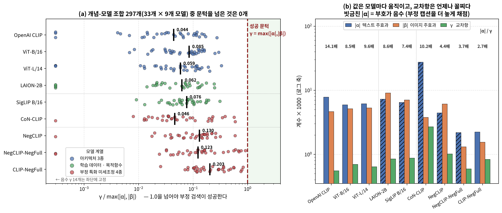
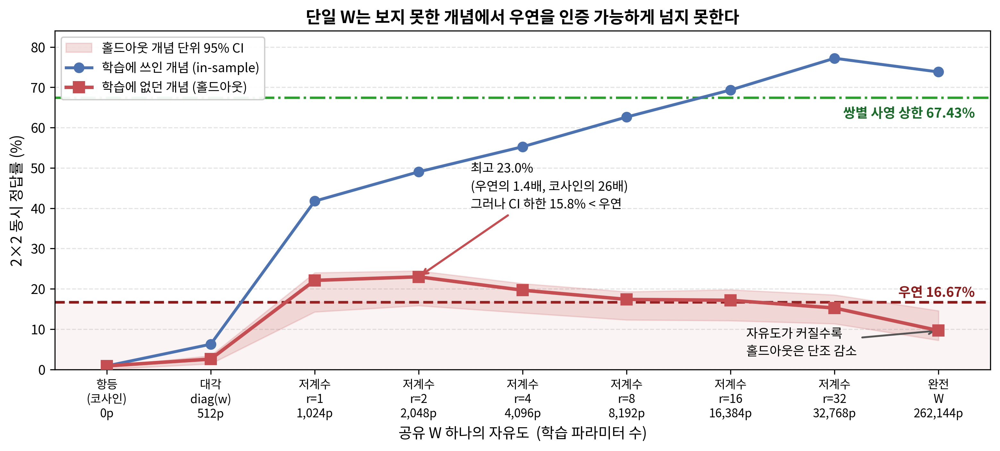
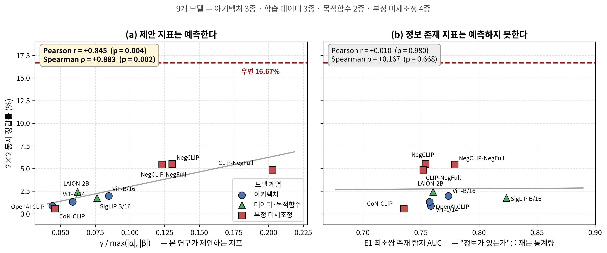

# 교차항이 너무 작다: 객체 단위 통제 하에서 CLIP 부정 검색 실패의 대수적 재진단

**The Interaction Term Is Too Small: An Algebraic Re-diagnosis of CLIP's Negation Retrieval Failure under Object-Level Control**

*저자·소속 (미정)*

---

## 초록

CLIP 계열 시각-언어 모델이 부정 쿼리에서 실패한다는 것은 반복 보고되었고, 최근 진단들은 서로 다른 해법을 제안하면서 하나의 전제를 공유한다. **필요한 정보는 인코더에 이미 표현되어 있으며 실패는 정렬 또는 결합 단계에서 일어난다**는 것이다. 이 전제는 서로 다른 장면끼리 비교한 존재 탐지, 부정 표지의 유무로 갈리는 문장 쌍의 극성 프로빙, 그리고 합성 데이터셋의 객체별 프로빙에 근거한다. 세 증거 모두 관심 변인 외의 요인이 통제되지 않았다.

본 연구는 **같은 장면에서 객체 하나만 제거한 이미지 최소쌍**과 **단어 집합이 동일하고 결합만 뒤바뀐 텍스트 최소쌍**으로 이 전제를 재검토한다. 전제는 살아남는다. 통제된 조건에서도 객체 존재 신호는 유지된다(최소쌍 존재 탐지 macro AUC 0.759). 그러나 같은 데이터에서 2×2 매칭 정확도는 **0.88%**로, 무작위 기준 16.67%를 크게 밑돈다.

두 관찰의 공존을 해명하기 위해 2×2 유사도를 평균·이미지 주효과 β·텍스트 주효과 α·교차항 γ로 분해한다. 이는 가정 없는 좌표 변환이며, 이 좌표계에서 부정 검색 성공의 필요충분조건은 항등식 Δ(S) = 2γ − 2max(|α|,|β|)에 의해 **γ > max(|α|,|β|)**로 정확히 주어진다. 33개 개념 1,357쌍에서 |α| = 0.0078, |β| = 0.0046, γ = 0.00056이었다. 교차항은 통계적으로 실재하고 객체 특이적이지만 텍스트 주효과의 1/14이며, **|α| > γ인 개념이 33/33, γ > |β|인 개념이 0/33**이다. 이 서열은 **아키텍처 3종·학습 데이터 3종·목적함수 2종·부정 특화 미세조정 4종에 걸친 9개 모델에서 개념 단위로 재현되며, 우연을 넘는 모델은 하나도 없다.** 무작위 이하 성능은 확률적 오차가 아니라 |α| > γ가 강제하는 결정론적 순서 역전이다.

세 계수는 공개된 개입 계열의 도달 가능성을 예측하고, 예측은 실측으로 검증된다. 텍스트 측 순수 증폭은 α와 γ를 함께 키워 비율을 보존하며(CoN-CLIP에서 |α| 3.5배·γ 4.9배·비율 1.05배로 확인), 이미지 증폭은 γ > |β|를 요구하므로 측정된 조건에서 불가능하다. 부정 미세조정은 사전 등록한 예측을 깨고 비율을 최대 4.6배 끌어올리는데, 그 경로는 교차항 증폭이 아니라 **긍정 편향 억제**이며 그럼에도 필요한 크기의 20%에 그친다. 방향 정렬은 실제로 적용했을 때 이론값의 절반에 그쳐 사전 등록한 판정에서 실패했다. 주효과를 쌍마다 정확히 소거하면 67.43%에 이르지만 그것은 쌍마다 다른 변환이며, **공유 변환 하나를 학습에 없던 개념에서 채점하면 최대 22.99%로 우연 초과가 인증되지 않는다.** 이 진단이 배제하는 것은 넓고 지지하는 것은 좁다. 마지막으로, 제안 지표 γ/max(|α|,|β|)는 9개 모델에서 2×2 정답률과 r = +0.845 (p = 0.004)로 상관하는 반면, 선행 연구가 "정보는 있다"의 근거로 쓰는 존재 탐지 AUC는 r = +0.010 (p = 0.980)으로 아무것도 예측하지 못한다.

**핵심어:** CLIP, 부정 이해, 시각-언어 모델, 객체 단위 통제, 요인 분해, 크로스모달 결합

---

## 1. 서론

이중 인코더 시각-언어 모델은 이미지와 텍스트를 공유 공간으로 사상하고 두 벡터의 내적을 매칭 점수로 쓴다. 이 인터페이스는 제로샷 검색에서 강력하지만 부정 쿼리에서는 신뢰할 수 없다 [1].

최근 진단들은 개입 지점이 서로 다르다. 텍스트 인코더 내부를 스티어링하거나 [2], 텍스트 임베딩에 선형 변환을 가해 모달리티를 정렬하거나 [5], 유사도 계산을 외부 논리 실행으로 대체하거나 [3], 코사인을 밀집 토큰 매칭으로 바꾼다 [4]. 그러나 이들은 공통 전제 위에 서 있다.

> **공통 전제.** 부정 검색에 필요한 정보는 인코더에 이미 표현되어 있다. 실패는 표현의 부재가 아니라 정렬 또는 결합의 문제다.

전제의 근거는 세 가지다. [3]은 COCO에서 이미지-개념 존재 탐지 AUC 0.88을 보고하고, [2]는 세 백본에서 레이어 4의 극성 분류 정확도 99% 이상을 보고하며, [5]는 합성 데이터에서 이미지 프로브 0.90–0.97·텍스트 프로브 0.98–0.99를 얻고 "정보가 없는 것이 아니라 정렬이 문제"라고 결론짓는다.

세 증거 모두 통제되지 않은 요인을 포함한다. [3]의 존재 탐지는 객체가 있는 이미지와 **서로 다른 장면**의 객체 없는 이미지를 비교하므로 높은 AUC가 장면 유형 판별로도 달성된다. [2]의 극성 프로빙은 원문과 그 부정문을 비교하므로 프로브가 **어느 객체가 부정되었는지** 모른 채 부정 표지의 유무만 탐지해도 성립한다. [5]는 실제 이미지가 필요한 통제를 제공하지 못한다는 이유로 합성 데이터를 명시적으로 택한다. 따라서 공통 전제는 **자연 이미지에서 장면을 고정한 채로는 검증된 바 없다.**

본 연구의 기여는 세 가지다.

1. **자연 이미지에서의 객체 단위 통제 프로토콜.** [5]가 통제를 이유로 합성 데이터로 후퇴한 지점에서 객체 제거 최소쌍과 동일 단어 집합 텍스트 최소쌍으로 자연 이미지 조건을 구성하고, 플라시보 검정으로 편집 흔적 가설을 배제한다.
2. **부정 검색 성공의 정확한 대수적 조건.** Δ(S) = 2γ − 2max(|α|,|β|)는 근사가 아니라 항등식이며, "정보의 존재"라는 이진 서술을 "계수 간 상대 크기"라는 측정 가능한 양으로 대체한다. 이 조건은 무작위 이하 성능이 왜 잡음이 아니라 필연인지도 설명한다.
3. **개입 계열의 도달 가능성 — 계산과 실측.** 각 개입이 세 계수를 어떻게 변환하는지 정리하고 상한을 계산한 뒤, 예측이 갈리는 두 지점을 실제로 실행하여 검증한다. 한 지점은 사전 등록한 기준에서 실패했고, 다른 지점은 도달 가능하나 단일 변환으로는 인증되지 않았다.

---

## 2. 통제된 최소쌍

**이미지.** BEAF [6]가 제공하는 COCO 2014 기반 원본/객체제거 쌍을 쓴다. 각 쌍은 같은 장면에서 특정 객체 하나만 인페인팅으로 제거되었으므로 배경과 나머지 객체가 공유된다. 원본과 편집본이 모두 정상 로드되고 유효 최소쌍이 20개 이상인 **33개 카테고리 1,357쌍**을 평가에 쓴다(개념당 중앙값 26쌍, 범위 20–310).

**텍스트.** 부정 표지의 유무로 갈리는 평범한 문장 쌍 대신, 두 문장이 **같은 단어 집합을 갖고 결합만 뒤바뀐** AB-swap 쌍을 쓴다.

```
A: There is a truck in this image, but no train.
B: There is a train in this image, but no truck.
```

개념 `truck`에 대해 A는 긍정, B는 부정이다. 두 문장의 **토큰 다중집합이 94.8%에서 동일**하고 **토큰 길이가 99.1%에서 동일**하므로, 부정 표지의 존재를 탐지하는 것만으로는 원리적으로 이득을 얻을 수 없다. 프로브는 "이 문장에 부정이 있는가"가 아니라 "어느 객체가 부정되었는가"를 풀어야 한다.

> **[Figure 1 — 직접 그려주십시오]**
> **개요도.** 2×2 격자. 행 = 이미지 두 상태(같은 COCO 장면의 원본 / 객체 하나만 인페인팅 제거 — 실제 썸네일 2장 권장), 열 = 캡션 두 상태(해당 객체 긍정 / 부정). 네 칸에 유사도 S₊₊, S₋₊, S₊₋, S₋₋를 배치하고, 대각(상태 일치) 두 칸을 초록, 반대각 두 칸을 빨강으로 음영.
> 격자 오른쪽에 분해 도식: 네 값 → **C**(전체 평균) + **β**(행 방향 차이 = 이미지 주효과) + **α**(열 방향 차이 = 텍스트 주효과) + **γ**(대각-반대각 차이 = 교차항). 각 성분을 2×2 부호 패턴(++/+−/−+/−−)의 작은 아이콘으로 표시하면 좋다.
> 맨 아래 한 줄: `성공 ⟺ min(S₊₊,S₋₋) > max(S₊₋,S₋₊) ⟺ γ > max(|α|,|β|)`, 그리고 `무작위 기준 = 1/C(4,2) = 16.67%`.
> 캡션: "2×2 최소쌍과 요인 분해. 네 유사도를 네 계수로 다시 쓰는 것은 가정 없는 좌표 변환이며, 이 좌표계에서 부정 검색 성공은 교차항이 두 주효과를 넘는 것과 정확히 동치다."

---

## 3. 요인 분해와 성공 조건

L2 정규화된 임베딩의 내적을 유사도 S(I,T)로 쓰고, 객체 O에 대해 이미지 상태 a ∈ {+1,−1}(존재/부재)와 텍스트 상태 b ∈ {+1,−1}(긍정/부정)을 정의한다. 네 조합의 유사도를 S_ab로 두면 임의의 네 실수는 다음과 같이 **유일하게** 분해된다.

```
S_ab = C + a·β + b·α + a·b·γ
```
```
C = (S₊₊+S₋₊+S₊₋+S₋₋)/4      β = (S₊₊−S₋₊+S₊₋−S₋₋)/4
α = (S₊₊+S₋₊−S₊₋−S₋₋)/4      γ = (S₊₊−S₋₊−S₊₋+S₋₋)/4
```

부정 검색이 올바르려면 상태가 일치하는 두 칸이 불일치하는 두 칸보다 모두 높아야 한다. 마진을 Δ(S) = min(S₊₊,S₋₋) − max(S₊₋,S₋₊)로 정의하면 다음이 **항등식으로** 성립한다.

> **명제 1.** Δ(S) = 2γ − 2·max(|α|, |β|). 따라서 **부정 검색 성공 ⟺ γ > max(|α|, |β|)**.

네 값의 상대 순서가 무작위일 때 Δ(S) > 0일 확률은 1/C(4,2) = **16.67%**다.

명제 1은 근사가 아니므로 검증 가능하다. 1,357쌍 전체에서 경험적 판정(Δ > 0)과 대수적 판정(γ > max)의 **비트 단위 일치율이 100.00%**, 최대 수치 불일치가 **4.16×10⁻¹⁷**였다. 세 백본에서 동일하다.

명제 1의 함의는 진단 대상의 교체다. 프로빙 정확도, 존재 탐지 AUC, 부정 방향의 일관성은 모두 "표현이 있는가"를 재는 통계량이며, 이들이 아무리 높아도 γ/max(|α|,|β|)를 결정하지 못한다. **성공은 정보의 유무가 아니라 어느 항이 가장 큰가에 달려 있다.**

**따름정리 — 무작위 이하의 기계적 설명.** |α| > γ이고 |α| > |β|이면 네 유사도의 순서가 강제되어 상태 일치 두 칸이 최댓값과 최솟값을 동시에 차지한다. 이때 실패는 확률적 오차가 아니라 결정론적 역전이며, 정확도는 우연을 **밑돈다.** [3]이 여섯 개 부정 특화 모델 모두에서 관찰한 무작위 이하 극성 AUC(9.3–19.0%)는 이유가 설명되지 않은 채 보고되었으나, 명제 1은 그것이 예외가 아니라 |α| > γ의 필연적 귀결임을 보인다.

---

## 4. 측정

### 4.1 전제는 살아남는다

객체별 선형 프로브는 두 모달리티 모두에서 무작위 기준을 넘는다(이미지 0.630, 텍스트 0.912; 이미지는 최소쌍을 한 폴드에 묶는 `GroupKFold`, 텍스트는 §2의 AB-swap 집합). 최소쌍 존재 탐지 macro AUC는 0.759로, 서로 다른 장면 조건의 0.783에서 소폭 하락하는 데 그친다. **통제해도 객체 상태 정보는 실재한다.**

이 신호가 인페인팅 흔적이 아님을 확인하기 위해, 같은 이미지 쌍에 대해 **양쪽 모두에 존재하는 무관한 객체**를 쿼리로 쓰는 플라시보 검정을 수행하였다. 개념별 이항검정에 BH-FDR 5%를 적용하면 오염이 입증되는 것은 **32개 중 4개**뿐이며, 그 4개를 제외한 부분집합에서 모든 수치가 오히려 **강화된다**(γ 0.000554 → 0.000827, 존재 탐지 AUC 0.759 → 0.812). 흔적이 신호를 만들고 있었다면 정반대로 움직였어야 한다.

### 4.2 그러나 크기가 문제다

같은 33개 개념 1,357쌍에서 계수를 측정하였다(Figure 2).

|계수|값|
|---|--:|
|\|α\| 텍스트 주효과|0.00781|
|\|β\| 이미지 주효과|0.00464|
|γ 교차항|0.00055|

- **\|α\| > γ: 33/33 (100%)**, 평균 비율 14.1배
- **γ > \|β\|: 0/33 (0%)**
- γ / max(\|α\|,\|β\|) 중앙값: **0.0439** — 필요한 크기의 4.4%

교차항은 잡음이 아니다. 개념 단위 t 95% CI가 [0.00034, 0.00078]로 0을 배제하고(Wilcoxon p = 2.0×10⁻⁸), 객체 X의 이미지 쌍에 무관한 객체 Y의 텍스트 극성 벡터를 대응시키는 순열 검정에서 귀무분포 평균이 −3.1×10⁻⁵(≈0)이며 33개 중 24개에서 매칭 γ가 유의하게 컸다. **γ는 객체 특이적 의미 상호작용이되, 텍스트 주효과의 1/14이다.**

관측된 2×2 매칭 정확도는 **12/1357 = 0.88%**로 무작위 기준의 1/19이다. §3의 따름정리가 이 값을 설명한다.

### 4.3 서열은 아키텍처·데이터·목적함수를 가로질러 유지된다

같은 개념 집합·같은 시드에서 패치 크기와 임베딩 폭이 다른 두 백본으로 전체 파이프라인을 재실행하였다.

|지표|ViT-B/32|ViT-B/16|ViT-L/14|
|---|--:|--:|--:|
|임베딩 폭|512|512|**768**|
|\|α\| / \|β\| / γ (×10³)|7.81 / 4.64 / 0.55|5.91 / 5.15 / 0.70|6.15 / 5.31 / 0.64|
|\|α\| / γ|14.1배|8.5배|9.6배|
|γ / max(\|α\|,\|β\|) 중앙값|0.0439|0.0847|0.0587|
|**\|α\| > γ 인 개념**|**33/33**|**33/33**|**33/33**|
|**γ > \|β\| 인 개념**|**0/33**|**0/33**|**0/33**|
|2×2 정답률 (우연 16.67%)|0.88%|1.99%|1.33%|
|항등식 최대 불일치|4.16×10⁻¹⁷|4.16×10⁻¹⁷|4.16×10⁻¹⁷|

**개별 계수는 모두 이동했으나 두 판정 비율은 정확히 같다.** 결손의 크기는 B/32에서 가장 크고 나머지 둘은 서로 가까우며(|α|/|β|가 1.68 → 1.15 → 1.16), 이는 차이를 만드는 것이 모델 규모가 아니라 패치 해상도임을 시사한다. 그럼에도 필요 증폭은 중앙값 11.8–13.8배이고 2×2 정답률은 우연의 1/45–1/13에 머문다. **실패의 크기가 달라졌을 뿐 종류가 같다.**

**학습 데이터와 목적함수를 바꿔도 같다.** 같은 아키텍처를 완전히 다른 데이터로 학습한 LAION-2B와, 대조 손실 대신 시그모이드 쌍별 손실을 쓰는 SigLIP B/16에서도 `|α| > γ` 33/33, `γ > |β|` 0/33이 유지된다. γ/max(|α|,|β|) 중앙값은 각각 0.0621과 0.0763으로, 아키텍처 변주가 만든 범위(0.044–0.085) 안에 있다. **즉 이 결손은 한 사전학습 계열의 성질이 아니다.**

|모델|학습 데이터|목적함수|γ / max|\|α\|>γ|γ>\|β\||2×2|
|---|---|---|--:|--:|--:|--:|
|ViT-B/32 (OpenAI)|WIT|softmax 대조|0.0439|33/33|0/33|0.88%|
|ViT-B/32 (LAION-2B)|LAION-2B|softmax 대조|0.0621|33/33|0/33|2.43%|
|ViT-B/16 SigLIP|WebLI|**시그모이드 쌍별**|0.0763|33/33|0/33|1.77%|

### 4.4 부정 미세조정은 비율을 옮긴다 — 그러나 문턱까지는 아니다

§5의 대수는 **텍스트 측 증폭이 α와 γ를 같은 배율로 키우므로 비율을 보존한다**고 예측한다. 부정 미세조정은 "부정 데이터를 늘리는" 개입이므로 이 예측의 직접적인 시험대다. 판정 기준은 실행 전에 고정하였다: **γ/max(|α|,|β|) 중앙값이 아키텍처 변주가 이미 만든 범위 0.044–0.085 안에 머무는가**, 즉 부정 미세조정이 패치 크기를 바꾸는 것보다 비율을 더 움직이는가.

**표 3. 부정 특화 모델** (33개 개념 1,357쌍, 괄호 안은 OpenAI CLIP 대비 배율)

|모델|\|α\||\|β\||γ|γ / max|\|α\|>γ|γ>\|β\||2×2|
|---|--:|--:|--:|--:|--:|--:|--:|
|OpenAI CLIP (기준선)|0.00781|0.00464|0.00055|0.0439|33/33|0/33|0.88%|
|CoN-CLIP|0.02747 (3.5×)|0.00376|0.00269 (4.9×)|**0.0460**|33/33|0/33|0.59%|
|NegCLIP [1]|0.00443 (0.6×)|0.00611|0.00101 (1.8×)|**0.1304**|32/33|0/33|5.53%|
|NegCLIP-NegFull|0.00219 (0.3×)|0.00131|0.00059 (1.1×)|**0.1231**|31/33|0/33|5.45%|
|CLIP-NegFull|0.00223 (0.3×)|0.00154|0.00083 (1.5×)|**0.2027**|32/33|1/33|4.86%|

**기준은 반증되었다.** 네 모델 중 셋이 0.085를 넘고, CLIP-NegFull은 4.6배까지 간다. 사전 등록한 처리에 따라 §5의 텍스트 증폭 논증을 "원리적 무효"에서 아래와 같이 정정한다.

**그런데 어떻게 넘었는지가 대수를 오히려 확인한다.** CoN-CLIP은 |α|를 3.5배, γ를 4.9배로 **함께** 키웠고 그 결과 비율이 0.0439 → 0.0460으로 거의 움직이지 않았다 — 순수 증폭의 예측 그대로다. 반면 NegCLIP과 두 NegFull 계열은 γ를 키운 것이 아니라 **α를 억눌렀다**(0.6배, 0.3배, 0.3배). NegCLIP-NegFull은 γ가 1.07배로 사실상 그대로인데 비율만 2.8배가 되었다. **즉 미세조정이 비율을 옮기는 경로는 교차항 증폭이 아니라 긍정 편향 억제이며, 이는 증폭이 아니므로 §5의 λ 논증이 적용되는 개입이 아니다.**

**그럼에도 어느 모델도 문턱을 넘지 못한다.** 최고인 CLIP-NegFull의 0.2027은 필요한 크기의 20%이고, `γ > |β|`는 33개 중 1개에서만 성립한다. 2×2 정답률 최고치는 5.53%로 우연 16.67%의 1/3이다. **비율은 4.6배 좋아졌지만 여전히 5배 부족하다.**

****
**Figure 2.** (a) 개념별 γ / max(|α|,|β|). 성공 문턱 1.0을 넘은 개념은 33개 × 3개 백본 = 99개 중 **0개**다. 세로 막대는 중앙값. (b) 세 계수의 매크로 평균. 값은 백본마다 다르지만 서열 |α| > |β| ≫ γ는 바뀌지 않는다.

---

## 5. 개입 가능성

명제 1은 각 개입이 세 계수를 어떻게 옮기는지 물을 수 있게 한다. 필요 조건은 γ > max(|α|,|β|)다.

**텍스트 증폭 — 증폭인 한 무효, 그러나 미세조정은 증폭만 하지 않는다.** 텍스트 임베딩을 t → λt로 키우면 α와 γ가 **같은 배율로** 커지므로 조건 λγ > λ|α|가 λ와 무관해진다. §4.4는 이 대수를 실측으로 확인한다 — CoN-CLIP은 |α|를 3.5배, γ를 4.9배로 함께 키웠고 비율은 0.0439 → 0.0460으로 사실상 불변이었다. [2]의 최적 스티어링 강도가 작은 값에서 멈추는 현상이 이것으로 설명된다.

**그러나 "부정 데이터로는 비율을 못 바꾼다"로 확장할 수는 없다.** 사전 등록한 기준(비율이 아키텍처 변주 범위 0.044–0.085를 벗어나지 않는다)은 네 부정 특화 모델 중 셋에서 **반증되었다**. NegCLIP과 두 NegFull 계열은 비율을 2.8–4.6배 끌어올렸고, 그 경로는 γ 증폭이 아니라 **α 억제**였다(|α|가 0.3–0.6배). 억제는 증폭이 아니므로 λ 논증의 적용 대상이 아니며, 미세조정은 λ가 표현할 수 없는 방향으로 표현을 옮길 수 있다.

**남는 결론은 더 좁고 더 정확하다.** 부정 데이터가 비율을 개선할 수는 있으나, 실제로 도달한 최대치는 필요한 크기의 20%(CLIP-NegFull 0.2027)이고 `γ > |β|`는 132개 개념-모델 조합 중 1개에서만 성립한다. **개선의 지렛대는 교차항을 키우는 것이 아니라 긍정 편향을 줄이는 것이며, 그 지렛대로도 5배가 부족하다.**

**이미지 증폭 — 측정된 조건에서 무효.** 이미지 측을 키우면 β와 γ가 같은 배율로 커져 조건이 γ > |β|로 귀착되는데, 이를 만족하는 개념이 세 백본 통틀어 하나도 없다. λ를 무한히 키워도 Δ(S) → 2λ(γ − |β|) < 0이다.

**방향 정렬 — 실행했고, 실패했다.** γ는 가법 모델에서 ¼·a_I·a_T·cos(d_I,d_T)로 근사되며, 이 모델은 현재 좌표에서 γ를 1.0% 오차·개념별 상관 r = 0.986으로 재현한다. 모델대로라면 정렬도를 0.107에서 1.0으로 올릴 때 γ가 9.37배가 되어 문턱을 넘는다. **이 예측은 논문에서 가장 강한 주장이면서 유일한 외삽이었으므로, 판정 기준을 실행 전에 고정하고 실제로 적용하였다.** 개념별 회전으로 프로브 법선을 1.000까지 정렬시키고 α를 10⁻¹¹까지 소거한 결과, 2×2 정답률은 α 소거 단독 대조군 7.6%를 유의하게 넘었으나(10.5–18.5%, 홀드아웃 채점) **γ 증폭은 4.85배로 이론값의 절반에 그쳐 사전 등록 기준 B에서 실패했다.**

원인은 둘이다. 첫째, 회전은 **프로브 법선**을 정렬시키지만 γ가 요구하는 것은 **임베딩 이동 방향**이며, 실측에서 역산한 이동 방향 정렬은 1.0이 아니라 약 0.52다. 둘째, 이 예측은 α를 없애면 문턱이 baseline의 |β|에 고정된다고 가정했으나 β는 상수가 아니어서 개입에 따라 0.79–1.68배로 움직인다. 실측/이론 비는 세 백본에서 0.71 / 0.64 / 0.71로, **가법 모델이 국소적으로 타당하고 원거리에서 깨진다는 것이 백본을 가로질러 재현된다.**

**점수 함수 교체 — 도달하지만 단일 변환으로는 인증되지 않는다.** 점수를 S_W(I,T) = e_I^T W e_T로 일반화하면 세 계수를 독립적으로 조정할 자유도가 생기고, α_W = β_W = 0인 W에 대해 조건이 γ_W > 0으로 완화된다. 주효과를 쌍마다 정확히 사영 제거하면(잔차 |α| ≤ 2.4×10⁻¹¹) 2×2 정답률이 0.88% → **67.43%**가 된다. 이 일치 자체는 구성상 자명하지만, 검증되는 실질적 명제는 따로 있다 — **사영이 교차항을 훼손하지 않는가.** γ > 0인 쌍의 비율은 소거 전후로 +0.005퍼센트포인트만 움직였다. §3의 좌표계가 주효과와 교차항을 실제로 분리한다는 직접 증거다.

그러나 그 사영은 쌍마다 다른 W이고 실제 검색기는 하나를 쓴다. **공유 W 하나가 학습에 없던 개념에서 어디까지 가는지**를 자유도 사다리로 측정하였다(개념 단위 `GroupKFold`, Figure 3).

|W 족|학습 파라미터|in-sample|**홀드아웃**|개념 95% CI|
|---|---:|---:|---:|---|
|항등 (= 코사인)|0|0.88%|**0.88%**|[0.07, 0.77]|
|대각 diag(w)|512|6.26%|**2.58%**|[1.40, 3.41]|
|저계수 r = 1|1,024|41.77%|**22.11%**|[14.28, 24.01]|
|**저계수 r = 2**|2,048|49.04%|**22.99%**|[15.84, 24.46]|
|저계수 r = 32|32,768|77.22%|15.25%|[11.35, 18.50]|
|완전 W|262,144|73.82%|**9.65%**|[7.23, 14.57]|

항등 행이 코사인 기준선 0.88%를 정확히 재현하는 것이 하네스 정합성 검증이다. **어느 족도 개념 단위 CI 하한이 우연 16.67%를 넘지 못한다.** 다만 이는 깨끗한 부정이 아니라 검정력의 한계다 — 최선인 rank 2의 22.99%는 우연보다 6.3pp 높고 코사인의 26배이며 단측 부트스트랩 p ≈ 0.057이지만, 33개 개념에서 CI 반폭이 4.3pp라 23%와 16.67%를 분리할 수 없다.

****
**Figure 3.** 공유 W 하나의 자유도 사다리. 홀드아웃 정확도는 저계수에서 정점을 찍고 자유도가 커질수록 단조 감소하며, 같은 구간에서 in-sample은 계속 오른다(일반화 격차 3.7pp → 64.2pp). 초록 선은 쌍별 사영 상한으로, 쌍마다 다른 W에 해당하므로 단일 W로는 도달할 수 없는 참조점이다.

---

## 6. 논의

**배제하는 것은 넓고 지지하는 것은 좁다.** 텍스트 증폭은 원리적으로, 이미지 증폭은 측정된 조건에서, 방향 정렬은 실측으로 배제된다. 인터페이스 교체는 배제되지 않지만 아직 지지되지도 않았다 — 단일 W가 닿는 곳은 인증되지 않은 22.99%다.

**부정 데이터의 지렛대는 교차항이 아니라 긍정 편향이다.** 부정 특화 미세조정 네 종 중 셋이 비율을 2.8–4.6배 끌어올렸고, 그 경로는 예외 없이 α 억제였다(§4.4). 교차항을 키우려 한 유일한 모델(CoN-CLIP)은 α도 함께 키워 비율을 그대로 두었다. 그러나 억제로 도달한 최대치도 필요한 크기의 20%다.

**병목은 표현이 아니라 이 규모가 지탱하는 용량이다.** Figure 3에서 홀드아웃 정확도가 저계수에서 정점을 찍고 단조 감소하는 반면 in-sample은 계속 오른다. 신호가 없어서가 아니라 1,357쌍이 262,144개 파라미터를 지탱하지 못하기 때문이다.

**필요한 것은 표현력이 아니라 교차 차원 구조다.** 차원별 재가중(대각, 512개 파라미터)은 홀드아웃 2.58%에 그치는 반면 교차 차원을 쓰는 rank 1(1,024개)은 **22.11%로 8.6배**다. 파라미터가 두 배여서가 아니라 구조가 다르기 때문이며, 이 대비는 **보지 못한 개념에 대한 일반화**에서 성립한다. rank 1의 W = ab^T는 S(v,t) = (a·v)(b·t)로 비전 검출기와 텍스트 검출기의 곱이고, 2×2 성공은 두 인자의 부호가 함께 뒤집힐 때 성립한다. 단일 W가 발견하는 최소 구조가 그것이다. [3]·[4]의 인터페이스 진단과 같은 방향이되, 그 인터페이스가 얼마나 작아도 되는지를 수치화한다.

**실용적 함의는 진단 지표에 있고, 이제 그 지표가 실제로 예측한다는 증거가 있다.** 아키텍처 3종·학습 데이터 3종·목적함수 2종·부정 미세조정 4종에 걸친 9개 모델에서, 제안 지표 γ/max(|α|,|β|)는 2×2 정답률과 **Pearson r = +0.845 (p = 0.004), Spearman ρ = +0.883 (p = 0.002)** 로 상관한다. 같은 9개 모델에서 "정보가 있는가"를 재는 통계량인 최소쌍 존재 탐지 AUC는 **r = +0.010 (p = 0.980)** 으로 상관이 사실상 0이다(Figure 4).

가장 선명한 대비는 SigLIP과 CLIP-NegFull이다. SigLIP은 아홉 모델 중 존재 탐지 AUC가 가장 높지만(0.824) 2×2 정답률은 1.77%인 반면, CLIP-NegFull은 AUC가 가장 낮으면서도(0.752) 4.86%다. **표현이 있느냐를 재는 지표로는 두 모델의 순서를 거꾸로 읽게 된다.** γ/max(|α|,|β|)는 2×2 최소쌍만 있으면 어떤 모델에 대해서도 계산할 수 있고, 어떤 개입이 어느 축을 얼마나 움직였는지를 직접 드러낸다.

****
**Figure 4.** 9개 모델에서 2×2 정답률의 예측 변수 비교. (a) 제안 지표 γ/max(|α|,|β|). (b) 최소쌍 존재 탐지 AUC — 선행 연구가 "정보는 있다"의 근거로 쓰는 종류의 통계량. 점선은 무작위 기준 16.67%로, **아홉 모델 모두 그 아래에 있다.**

---

## 7. 한계

1. **검정력.** 단일 W의 최선값(22.99%)은 33개 개념에서 우연 초과가 인증되지 않는다(단측 p ≈ 0.057). "우연이다"가 아니라 "이 표본으로는 판정할 수 없다"이며, 개념 수를 늘리는 것이 직접적인 후속이다. 2×2 성공 사례가 12개로 적어 성공 조건의 세부 특성화도 제한적이다.
2. **모델 범위.** 계수와 판정은 아키텍처(패치 32/16/14, 폭 512/768), 학습 데이터(WIT·LAION-2B·WebLI), 목적함수(softmax 대조·시그모이드 쌍별), 부정 특화 미세조정 4종에 걸쳐 재현되었다. 남는 것은 이중 인코더라는 구조 자체다 — LLM 기반 임베더나 밀집 토큰 매칭 인터페이스는 다루지 않았으며, 후자는 [4]가 제안한 방향이다.
3. **인페인팅 흔적.** 개념별 검정으로 오염을 4개로 특정하고 제외 시 결과가 강화됨을 보였으나, 원래부터 해당 객체가 없는 실제 이미지와의 비교는 수행하지 않았다. 이는 장면 통제가 성립하지 않는 별개의 질문이다.
4. **가법 모델의 지위.** §3의 항등식은 무가정이지만 §5의 기하학적 해석은 가법성에 의존하며, 국소적으로만 타당하다는 것이 실측으로 확인되었다.
5. **범위.** 대상의 존재 부정만 다루며 관계 부정이나 행위 부정은 다루지 않는다. 텍스트 템플릿도 단일 계열이다.

---

## 참고문헌

[1] Alhamoud, K., et al. "Vision-language models do not understand negation." CVPR, 2025.

[2] Sammani, F., Chamiti, T., Gavrikov, P., Deligiannis, N. "When Negation Is a Geometry Problem in Vision-Language Models." CVPR, 2026.

[3] Alshehri, S., Yang, Z., Zhang, H., Savvides, M. "Similarity Is Not Logic: Factored Inference for Dual-Encoder Vision-Language Models." ICML, 2026.

[4] Kang, R., et al. "Is CLIP ideal? No. Can we fix it? Yes!" ICCV, 2025.

[5] Koishigarina, D., Uselis, A., Oh, S. J. "CLIP behaves like a bag-of-words model cross-modally but not uni-modally." ICLR, 2026.

[6] Ye-Bin, M., et al. "BEAF: Observing before-after changes to evaluate hallucination in vision-language models." ECCV, 2024.
